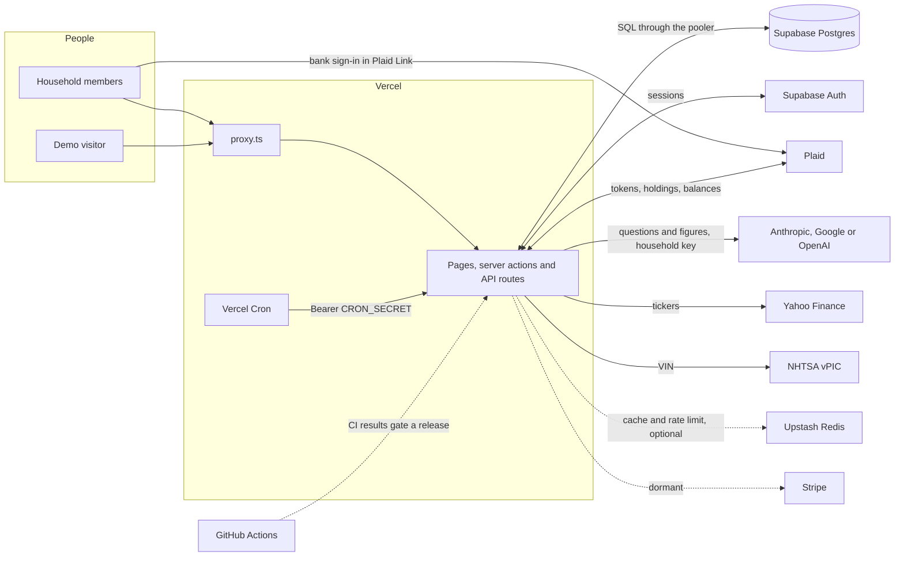
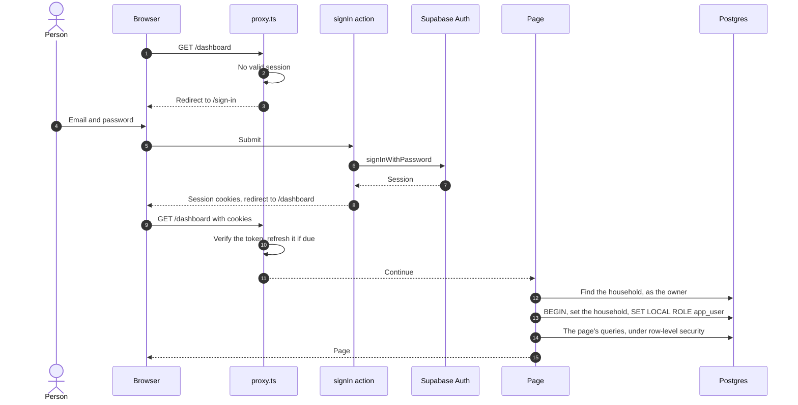
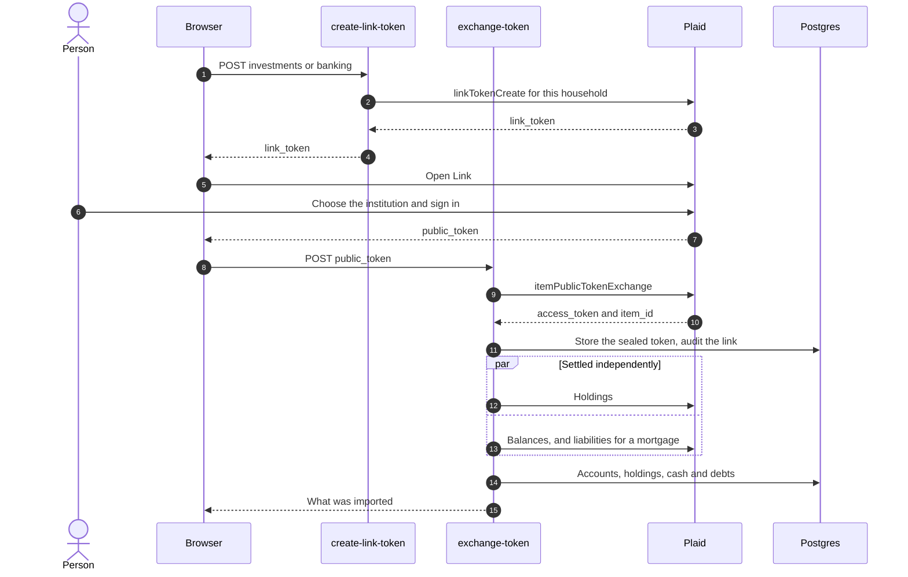
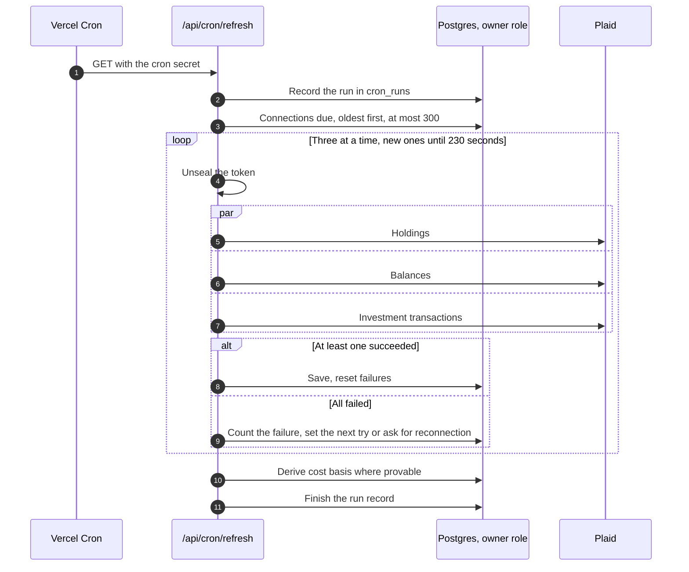
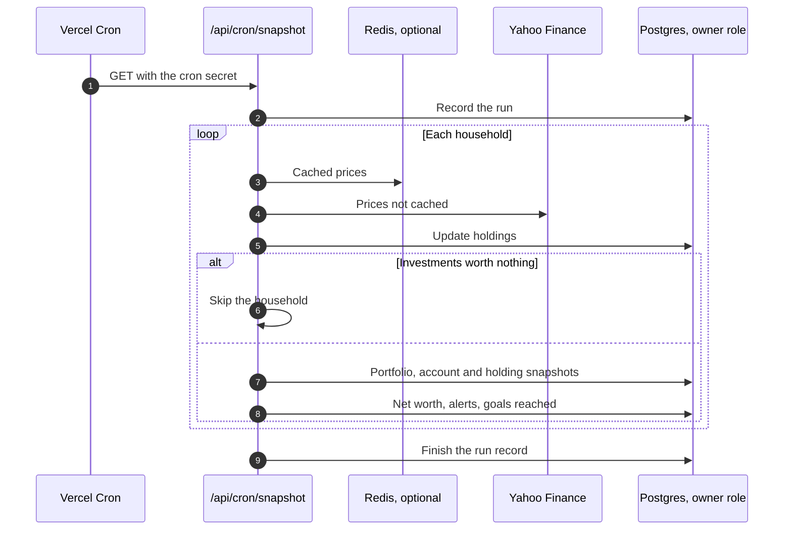
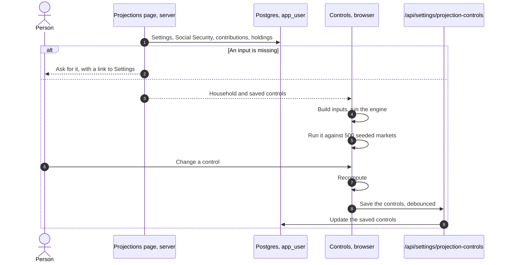
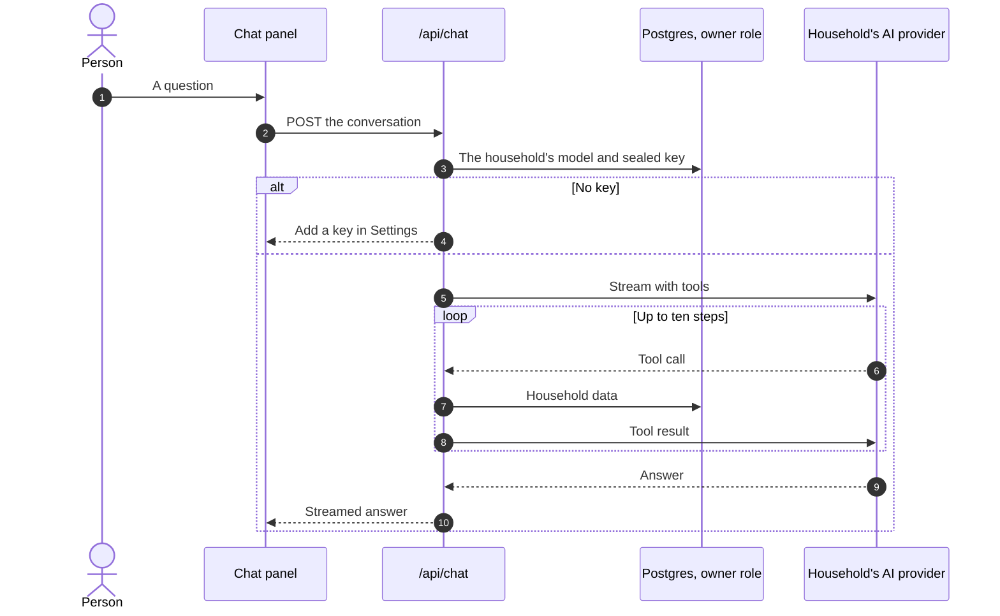
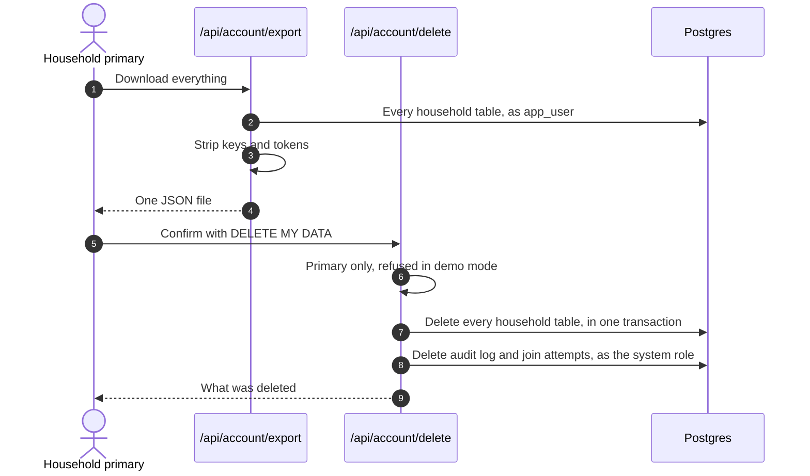
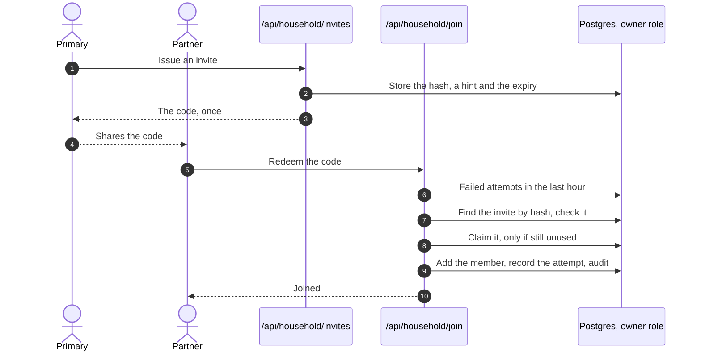
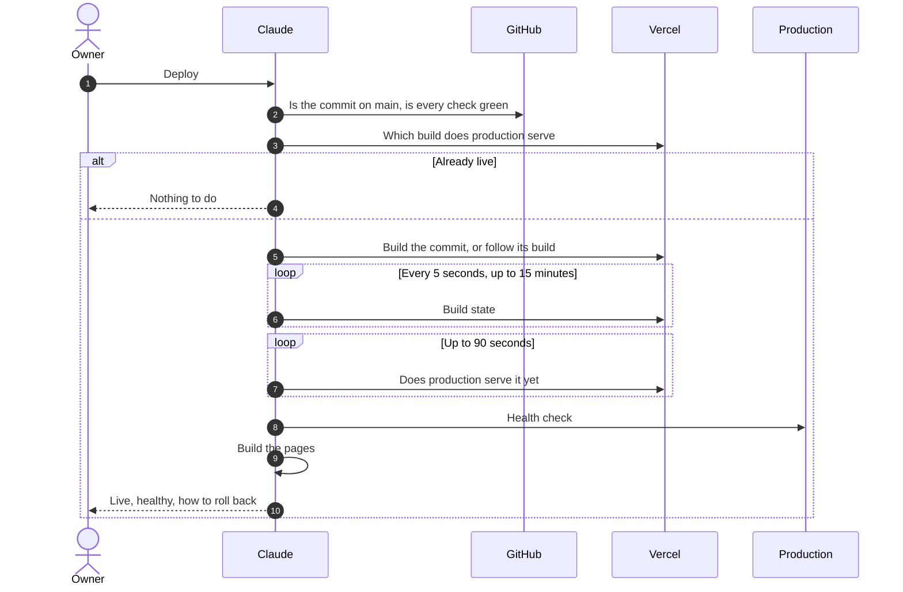

# RetireWise technical architecture

Last reviewed: 2026-10-04

RetireWise is a retirement planner for one household at a time, used by its owner, family and friends. It is one Next.js application on Vercel, backed by one Supabase project for its Postgres database and its sign-in. Plaid brings in bank and brokerage data, Yahoo Finance supplies prices, and each household's own Anthropic, Google or OpenAI key answers questions about its plan.

This document is half generated. The inventory at the end is read from the code each time the page is built. The rest is written here, and `pnpm arch:check` fails CI when it stops covering the code: a dependency, environment variable, scheduled job, CI job, API group or module it does not name, a file it names that has gone, or a risk tied to a backlog item that is closed. The database is described in `docs/DATA-MODEL.md`.

<!--
How to edit
- Sections are "## Name". Principles, key flows, quality attributes, risks and decision records are "### Entry" headings.
- A key flow has numbered steps and a ```mermaid sequence diagram.
- A risk starts with "- Backlog: #N" (open items only) and "- Severity: High | Medium | Low".
- A decision record is "### ADR-NNN. Title" with Status (Accepted | Proposed | Superseded by ADR-NNN | Deprecated),
  Decided, Context, Decision, Consequences and Evidence (at least one file). Numbers are permanent; supersede, never delete.
- Name every runtime dependency and environment variable in backticks, every scheduled job by path, every CI job
  by name, every API group as /api/<group>, and every module under src/lib by path. `pnpm arch:check` lists what is missing.
- Add a change-log line ("- YYYY-MM-DD · what changed · who") with every change.
-->

## Principles

### The database keeps households apart, not the person writing the query

- Evidence: `src/lib/db/tenant.ts`, `src/lib/auth-helpers.ts`, `scripts/test-rls.ts`, `scripts/check-tenant-scope.ts`

Household work runs inside `withTenant`, as a role that owns nothing and cannot bypass row-level security, with the household's id set for that transaction only. A query that forgets its filter returns nothing rather than someone else's money. Escalating is explicit and names its reason: `withSystemRole(reason, fn)`. Some routes still run without it (#33).

### Unknown is shown as unknown, never as a plausible number

- Evidence: `src/lib/plaid/sync.ts`, `src/lib/utils/cost-basis.ts`, `src/lib/performance/twr.ts`, `src/lib/utils/freshness.ts`, `src/lib/tax/table.ts`

A missing cost basis stays empty instead of becoming the market value. Dividends come only from recorded payments. A return is refused when the history is too short. The tax table says which year it holds and whether it came from the database or the code, and every total says how old its oldest input is.

### Ask rather than assume a missing input

- Evidence: `src/lib/planning-inputs.ts`, `src/components/planning/missing-inputs.tsx`, `scripts/test-missing-inputs.ts`

No projection runs until the household has given its age, retirement age and retirement spending. Each missing field is asked for where the figure would appear, with a link to it in Settings, and the assistant asks in the same words. A fund whose fee is unknown is left out of the fee figures and counted on screen.

### One tested implementation per figure

- Evidence: `src/lib/utils/projection-scenarios.ts`, `src/lib/projections/monte-carlo.ts`, `src/lib/net-worth/compose.ts`, `scripts/test-one-engine.ts`, `scripts/test-net-worth.ts`

"Will the money last?" has one answer, from one engine; the odds are that engine run against 500 seeded markets, and the page and the assistant build its inputs with the same functions. Net worth is composed by one function wherever it appears.

### The household brings its own AI key

- Evidence: `src/lib/ai/model.ts`, `src/lib/ai/user-model.ts`, `src/app/api/settings/ai-provider/route.ts`

Every AI call uses the household's own key and fails with a pointer to Settings when there is none. There is no fallback to a key the operator pays for.

### Secrets are sealed at rest and can be rotated

- Evidence: `src/lib/crypto/keyring.ts`, `src/lib/utils/encryption.ts`, `src/lib/plaid/encryption.ts`, `scripts/rotate-keys.ts`, `scripts/test-ops.ts`

Bank access tokens and AI keys are encrypted with AES-256-GCM under a versioned format. Decryption also tries the previous key, so a rotation is a window rather than a cliff. Exports strip secrets, and the public health checks return only yes, no and ages.

### Fail soft, visibly, and never with a confident wrong figure

- Evidence: `src/lib/auth.ts`, `src/proxy.ts`, `src/lib/plaid/backoff.ts`, `src/app/api/health/freshness/route.ts`

If sign-in is unreachable, visitors are treated as signed out rather than shown an error. A failing bank connection is retried with a growing wait and set aside only when a person must act. Every scheduled run is recorded, and the freshness check fails when a job has stopped.

### Never silently destroy what a person entered

- Evidence: `src/lib/plaid/sync.ts`, `src/lib/actions/import-statement.ts`, `src/app/api/account/delete/route.ts`

A cost basis typed by hand is never overwritten by a sync. Positions a sync removes are copied in full to the audit log first. A statement older than the recorded balance is refused, and erasure needs a typed phrase. The holdings file import still breaks this (#38).

### Production changes only on command

- Evidence: `vercel.json`, `scripts/deploy-production.ts`, `AGENTS.md`

Merging does not deploy. Production moves only when the owner asks and `pnpm deploy:prod` runs, which ships only a commit on main with green CI and confirms production serves it and is healthy.

### Documents that make claims are checked in CI

- Evidence: `scripts/build-backlog.ts`, `scripts/build-traceability.ts`, `scripts/build-architecture.ts`, `scripts/build-data-model.ts`, `scripts/build-how-it-works.ts`, `scripts/test-privacy-page.ts`

The backlog, the requirements trace, this document, the data model, the explanation of every calculation and the privacy page are all checked against the code in CI. A pull request that changes what they describe has to change them too, or say in a commit message why it does not. Their pages are published only after a release, so they describe what is live.

## System context

RetireWise has one deployment, one database and one operator. Everything a person sees is served by the Next.js app on Vercel; everything it remembers is in Supabase.



| Who | How they reach RetireWise | What they may do |
| --- | --- | --- |
| Owner and operator | Holds the Vercel, Supabase, Plaid and GitHub accounts; approves merges and releases | Everything; usually also the primary member of a household |
| Household primary | Signs in; their id is the key every household row is stored under | All reads and writes; alone may invite, revoke and erase |
| Household member | A partner who joined by invite; their sign-in maps to the primary's id | All reads and writes except inviting and erasing; cannot leave yet (#35) |
| Demo visitor | Anonymous, with a demo cookie, only when demo mode is switched on | Reads a seeded household; every write is refused |
| Claude | Pull requests, and `pnpm deploy:prod` on the owner's word | Publishes the generated pages after a release |
| Machines | Vercel Cron, the Plaid and Stripe webhooks, health checks | Authenticated by a secret or a signature, never a session |

| System | Direction | What crosses | Code |
| --- | --- | --- | --- |
| Supabase Postgres | Both ways | Every table; the app connects as the table owner and drops to the restricted role per request. The Supabase Data API sees nothing, because no policy admits its roles | `src/lib/db/index.ts` |
| Supabase Auth | Both ways | Email and password sign-in; the session lives in cookies, and the token is verified on every request | `src/lib/auth.ts`, `src/lib/supabase/server.ts` |
| Vercel | Hosts the app | Pages, routes, the proxy and two scheduled jobs on the Node.js runtime; environment variables; short-lived logs | `vercel.json` |
| Plaid | Browser to Plaid, app to Plaid | Bank credentials go only to Plaid's window. The app exchanges tokens and reads holdings, balances, liabilities and investment transactions. Plaid's webhooks are not registered (#14), and nothing removes a connection at Plaid (#62) | `src/lib/plaid/sync.ts` |
| Anthropic, Google, OpenAI | App to provider | The question, the conversation and tool results with household figures, under the household's own key | `src/lib/ai/model.ts` |
| Vercel AI Gateway | App to gateway | Only when the operator enables it; Settings does not offer it | `src/lib/ai/model.ts` |
| Yahoo Finance | App to Yahoo | Ticker symbols out, prices back | `src/lib/utils/price-feed.ts` |
| NHTSA vPIC | App to NHTSA | A VIN out, make, model and year back | `src/lib/actions/vehicles.ts` |
| Upstash Redis | Both ways, optional | Price cache and the chat rate limit | `src/lib/redis.ts` |
| Stripe | Both ways, dormant | Checkout, the customer portal and a signed webhook, inert until both keys are set | `src/lib/billing/stripe.ts` |
| GitHub | Source and CI | CI on every push; the release reads a commit's check results | `.github/workflows/ci.yml` |

Links to Zillow, Kelley Blue Book, Fidelity, the SSA and the IRS open in the person's own browser; the server sends those sites nothing.

## Frontend

- **App Router.** Pages live under `src/app`: a public landing page, sign-in and sign-up, the signed-in pages under `src/app/(dashboard)`, and the privacy and terms pages. Next 16 renamed middleware to proxy, so session checks live in `src/proxy.ts`.
- **Server first.** Pages are async server components that wrap their work in `withHousehold`, read through `src/lib/queries` and pass plain data to client components beside them. Mutations are server actions in `src/lib/actions`, or a fetch to an API route for Plaid, settings, alerts, chat, invites and account data.
- **The heavy maths runs in the browser.** The projection engine and its 500-run Monte Carlo run in the browser as controls change, and on the server for the first render. They are seeded, so both agree.
- **Components.** `src/components/ui` holds shadcn components (`shadcn`, `@base-ui/react`, `class-variance-authority`, `clsx`, `tailwind-merge`) and app primitives for money, freshness and the tax year. Charts use `recharts`; icons `lucide-react`; themes `next-themes`; animation helpers `tw-animate-css`. Small hooks live in `src/lib/hooks`, and the `cn()` class helper in `src/lib/utils.ts`.
- **Chat.** The assistant panel uses `@ai-sdk/react` and streams from `/api/chat`. `src/lib/agents` holds only its message type; the agent itself is configured in the route.
- **Phones first.** Layouts use the dynamic viewport height and safe-area insets, inputs are 16px so iOS does not zoom, and pinch zoom stays on. CI checks the layout on two iPhones and a Pixel.
- **Unused.** `nuqs`, `react-rnd`, `re-resizable` and `cmdk` are installed but nothing reaches them (#52).

## Identity, households and authority

- **Sign-in.** `src/lib/actions/auth.ts` signs people in and up with Supabase Auth through `@supabase/ssr`; `@supabase/supabase-js` is its client. There is no password reset, and sign-in ignores where the person was going (#48). Sign-up is open and accounts are confirmed automatically (#53).
- **Every request.** `src/proxy.ts` verifies the session token on every path except static files and the machine routes, forwards refreshed cookies, and sends a signed-out visitor to sign-in (or a 401 for an API). If Supabase Auth fails, the visitor is treated as signed out.
- **Which household.** `src/lib/auth-helpers.ts` maps the signed-in person to their household through `household_members`, and every row is filed under the primary member's id. `src/lib/household.ts` creates households; `src/lib/invites.ts` issues and redeems invites. The column is still called `clerk_id`, from the previous sign-in provider (ADR-003).
- **Owner powers.** Only the primary may issue or revoke invites and erase the household's data. Every other write is open to any member. Leaving or removing a member is not built (#35), and a person who joins a household loses sight of anything they entered before (#63).
- **Demo mode.** Switched on only when `NEXT_PUBLIC_DEMO_ENABLED` is "true". A cookie then lets a visitor read a seeded household through the same restricted role, and every write wrapper refuses.

| Wrapper | Used by | In demo mode | Signed out | Runs as |
| --- | --- | --- | --- | --- |
| `withHousehold` | pages | reads the demo household | error | `app_user`, row-level security |
| `withWriteHousehold` | server actions | refused | error | `app_user`, row-level security |
| `withApiHousehold` | API routes that read | reads the demo household | 401 | `app_user`, row-level security |
| `withApiWriteHousehold` | API routes that write | 403 | 401 | `app_user`, row-level security |
| `withSystemRole` | scheduled jobs, webhooks, health, manual bank sync, the tax refresh, part of erasure | not applicable | not applicable | table owner, no row-level security |
| none | `/api/chat`, `/api/prices/refresh`, `/api/billing/status`, `/api/household/*` | varies | varies | table owner; only the route's own filters (#33) |

`scripts/check-protected-routes.ts` fails CI when a signed-in page is missing from the proxy's protected list; `scripts/check-tenant-scope.ts` fails it when a new entry point reaches the database without a wrapper.

## Server-side logic

| Module | What it does |
| --- | --- |
| `src/lib/db` | Drizzle schema, migrations, the connection and the tenant wrappers |
| `src/lib/auth.ts`, `src/lib/auth-helpers.ts`, `src/lib/supabase` | Sessions, household resolution and the scoping wrappers |
| `src/lib/household.ts`, `src/lib/invites.ts` | Households and invitations |
| `src/lib/actions` | Server actions: every form in the app |
| `src/lib/queries` | Read queries shared by pages |
| `src/lib/accounts` | Pairing a linked account with its hand-entered twin |
| `src/lib/plaid` | Plaid client, sync, investment transactions, retry policy, token sealing and webhook verification |
| `src/lib/projections` | Inputs to the engine: households, accounts, saved settings, Monte Carlo, balances at retirement |
| `src/lib/planning-inputs.ts` | The three inputs a projection cannot run without |
| `src/lib/tax` | The tax table: shape, figures built into the code, seed rows and the loader |
| `src/lib/net-worth` | Loading and composing net worth, each liability once |
| `src/lib/goals` | Goal progress over linked items |
| `src/lib/performance` | Time-weighted return from daily share counts |
| `src/lib/import` | OFX and QFX statements |
| `src/lib/utils` | The engine (`src/lib/utils/projection-scenarios.ts`), analytics, withdrawal orders, cost basis, prices, alerts, snapshots, CSV, encryption and formatting |
| `src/lib/ai`, `src/lib/agents`, `src/lib/tools` | Model resolution, the chat message type, and the assistant's eleven tools |
| `src/lib/billing` | Plans, entitlements and Stripe, dormant |
| `src/lib/account` | Export and erasure |
| `src/lib/audit.ts` | The audit trail, which never throws |
| `src/lib/crypto` | The versioned key ring behind both kinds of sealed secret |
| `src/lib/redis.ts` | Optional Upstash client for the price cache and the chat limit |
| `src/lib/onboarding.ts` | The setup checklist |
| `src/lib/constants.ts`, `src/lib/constants-net-worth.ts`, `src/lib/types.ts` | Labels, contribution limits for 2025 (#31), and shared types |

- **API groups.** `/api/account` exports and erases; `/api/alerts` lists and dismisses; `/api/billing` is dormant checkout, portal, status and webhook; `/api/chat` is the assistant; `/api/cron` holds the two scheduled jobs; `/api/export` writes the CSVs and the portfolio report; `/api/health` holds the liveness and freshness checks; `/api/household` creates, invites and joins; `/api/irs-limits` refreshes the shared tax and limit tables; `/api/plaid` links, syncs and receives webhooks; `/api/prices` refreshes prices; `/api/report` writes the AI report and infographic; `/api/settings` saves the AI provider and projection controls.
- **The engine.** `runDetailedProjection` in `src/lib/utils/projection-scenarios.ts` projects each account year by year: contributions, employer money, pauses, catch-up, Social Security, federal tax on withdrawals, and required minimum distributions from tax-deferred accounts only. The Projections page and the assistant never pass it the tax table from the database, so they use the figures built into the code (#61).
- **Analytics.** `src/lib/utils/financial-analytics.ts` covers distributions, Roth conversions, Social Security claiming, catch-up, income replacement, fees, sequence risk and healthcare costs, and reads the tax table from the database. Withdrawal orders are compared outside the engine (ADR-025).
- **The assistant.** `/api/chat` resolves the household's model, applies the rate limit when Redis is configured, and streams an answer with `ai` and `@ai-sdk/anthropic`, `@ai-sdk/google` or `@ai-sdk/openai`, calling up to ten tools that read the household's data. The tools use the same engine and net-worth composition as the pages.
- **Plaid.** `plaid` is the server client and `react-plaid-link` the browser's Link window. Connections are scoped by type: investments for brokerages, transactions with consented liabilities for banks and cards.
- **Prices.** `yahoo-finance2` in batches of 20, cached for 15 minutes in Redis through `@upstash/redis`; `@upstash/ratelimit` limits the assistant.
- **Imports.** `papaparse` reads holdings CSVs; `src/lib/import` reads bank statements.
- **Validation and data.** `zod` validates every form and request body; `drizzle-orm` over `postgres` talks to the database.
- **Billing.** `stripe`, inert until both keys are set; every household is complimentary today.
- **Framework.** `next`, `react` and `react-dom`.

## Key flows

### Sign-in

1. A signed-out request for a signed-in page reaches the proxy, which finds no valid session and redirects to sign-in.
2. The sign-in form posts to a server action, which signs in with Supabase Auth and sets the session cookies.
3. The action redirects to the dashboard; where the person was going is ignored (#48).
4. On the next request the proxy verifies the token and forwards refreshed cookies.
5. The page resolves the household as the owner, then opens a transaction as the restricted role for its own queries.



### Connecting a bank or brokerage

1. The Link button asks `/api/plaid/create-link-token` for a token, naming investments or banking. Demo mode is refused.
2. Plaid's Link window opens in the browser and the person signs in to their institution there; RetireWise never sees the credentials.
3. Plaid hands back a public token, which `/api/plaid/exchange-token` swaps for an access token. The token is sealed and stored, and the link is audited.
4. Holdings and balances are synced at once, each settling on its own, and the pages refresh.



### Daily bank refresh and Sync now

1. At 10:00 UTC Vercel Cron calls `/api/cron/refresh` with the cron secret; the route records a run in `cron_runs`.
2. It takes up to 300 connections that are due, oldest first, three at a time, and stops starting new ones after 230 seconds.
3. Each connection syncs holdings, balances and investment transactions. Any success resets its failures; three failures in one run count as one failed attempt, which sets the next try further out, until eight failures or an error only the owner can fix sets it aside.
4. Cost basis is derived where transactions prove it, and the run's counts are recorded.
5. Sync now, from `/api/plaid/sync`, does the same for one household after resolving it from the session, with a two-minute cooldown per connection.



### Weekday snapshot

1. At 22:00 UTC on weekdays Vercel Cron calls `/api/cron/snapshot`, which records a run.
2. For each household with accounts it refreshes prices, then writes portfolio, account and holding snapshots. A household with no investments is skipped (#49).
3. It writes the day's net worth, generates alerts and marks goals that have been reached.
4. The run is recorded as successful whatever happened to each household (#49).



### A projection

1. The Projections page reads the household's settings, Social Security, contributions and holdings in one transaction as the restricted role.
2. If the age, retirement age or spending is missing, it asks for them instead of projecting.
3. Otherwise the browser builds the engine's inputs, runs the year-by-year projection, and runs the same engine against 500 seeded markets for the odds.
4. Changing a control recomputes in the browser and saves the controls, which the assistant also reads.



### Asking the assistant

1. The chat panel posts the conversation to `/api/chat`; the proxy requires a session.
2. The route resolves the household, applies the rate limit when Redis is configured, and loads the household's own model, or answers that a key is needed.
3. The model answers in up to ten steps, calling tools that read the household's data and run the engine. These reads run as the table owner (#33).
4. The answer streams back to the panel.



### Export and erasure

1. Any member can download everything as one JSON file from `/api/account/export`, without secrets; the export is audited.
2. The primary can see what erasure would remove, then confirm by typing DELETE MY DATA.
3. Erasure deletes every household table in the request's transaction, then the audit log and join attempts through the system role on a separate connection. It does not remove the connection at Plaid (#62), and it misses snapshots of accounts deleted earlier (#58).



### Inviting a partner

1. The primary creates a household if there is none, then issues an invite; the code is shown once and only its hash is stored.
2. The partner signs up and enters the code. Redemption checks the rate limit, the code, the partner's existing membership, and claims the invite so only one person can.
3. From then on the partner's sign-in resolves to the primary's household.



### A release

1. The owner says deploy. `pnpm deploy:prod` refuses any commit not on main, or whose CI is not entirely green.
2. It reads which commit production actually serves, and stops if it is already live.
3. It builds that commit through the Vercel API, or follows a build of it already under way, and waits up to 15 minutes.
4. It waits up to 90 seconds for production to serve the new build, then requires the health check to pass.
5. Only then does it build the published pages, which describe what is now live. Migrations are applied separately (#6).



## Environments and configuration

- **Production.** The Vercel project serves `retirewise-iota.vercel.app` and is built only by `pnpm deploy:prod`; `vercel.json` turns off deploys from main. One Supabase project provides the database and sign-in. Two scheduled jobs run: `/api/cron/snapshot` and `/api/cron/refresh`.
- **Preview.** Every other branch gets a Preview build behind Vercel sign-in. Previews hold production database variables (#1) and lack Supabase's public settings, so nobody can sign in to one (#7).
- **Local.** `.env.local` feeds `pnpm dev` and the database scripts.
- **CI.** A throwaway Postgres 17, placeholder Supabase settings, demo mode on, and fixed test secrets; the browser tests never contact Supabase.

Environment variables, by name only. Values live in Vercel and in each developer's `.env.local`; `.env.example` lists them.

| Purpose | Names | Notes |
| --- | --- | --- |
| Database | `SUPABASE_DATABASE_URL`, `DATABASE_URL` | The second is a fallback that still points at the old Neon database in production (#10) |
| Sign-in, public | `NEXT_PUBLIC_SUPABASE_URL`, `NEXT_PUBLIC_SUPABASE_PUBLISHABLE_KEY`, `NEXT_PUBLIC_SUPABASE_ANON_KEY` | The anon key is the older alternative to the publishable key |
| Demo, public | `NEXT_PUBLIC_DEMO_ENABLED` | Must be exactly "true" |
| Scheduled jobs | `CRON_SECRET` | Also the fallback secret for sealing AI keys (#9) |
| Sealing secrets | `ENCRYPTION_KEY`, `ENCRYPTION_KEY_PREVIOUS`, `PLAID_TOKEN_ENCRYPTION_KEY`, `PLAID_TOKEN_ENCRYPTION_KEY_PREVIOUS` | The previous keys are set only during a rotation |
| Plaid | `PLAID_CLIENT_ID`, `PLAID_SECRET`, `PLAID_ENV` | The environment defaults to sandbox |
| AI | `AI_GATEWAY_ENABLED`, `AI_GATEWAY_API_KEY` | Off; households bring their own keys, which are stored sealed in the database |
| Redis | `KV_REST_API_URL`, `KV_REST_API_TOKEN`, `UPSTASH_REDIS_REST_URL`, `UPSTASH_REDIS_REST_TOKEN` | Either pair; optional |
| Billing, dormant | `STRIPE_SECRET_KEY`, `STRIPE_WEBHOOK_SECRET`, `STRIPE_PRICE_PLUS_MONTHLY`, `NEXT_PUBLIC_APP_URL`, `VERCEL_PROJECT_PRODUCTION_URL` | Billing switches on only when both Stripe keys are set; the last is set by Vercel |
| Release | `VERCEL_TOKEN`, `GITHUB_TOKEN`, `GH_TOKEN` | Read by `pnpm deploy:prod` |
| Tests | `CI`, `PORT`, `E2E_BASE_URL` | Read by `playwright.config.ts` |

## Delivery, quality and operations

- **CI.** `.github/workflows/ci.yml` runs on every push and pull request in two jobs. "Lint and types" runs lint, the type check, the static guards (tenant scope, protected routes), the document checks (backlog, requirements, architecture, data model, how it works, each with a rule that a pull request updates them) and every check of pure logic. "Mobile layout" starts Postgres, migrates and seeds it, runs the database checks (isolation, invites, export and erasure, onboarding), builds the app and runs the browser tests on three phones.
- **Branch protection.** None on main, so a direct push skips CI (#16). A release still refuses a commit whose CI is not green.
- **Release.** `scripts/deploy-production.ts` and `scripts/lib/release.ts`, as in the release flow above. Rolling back is a release of an older commit, which rebuilds it (#5), and nothing shows which commit is live (#4).
- **Published pages.** After a successful release, `pnpm deploy:prod` builds the backlog, requirements trace, technical architecture, data model and How RetireWise Works pages from the released commit, and Claude publishes them to their fixed addresses. The last of these bundles the projection engine with esbuild, a development dependency, so its calculators run the released code in the reader's browser.
- **Health.** `/api/health` checks the database and reports whether sign-in is configured; `/api/health/freshness` fails when a scheduled job has stopped or data has gone stale. Nothing outside calls either (#2), and errors go only to Vercel's short-lived logs (#8).
- **Runbooks.** `docs/disaster-recovery.md` (daily backups, a four-hour recovery target, never rehearsed: #17), `docs/incident-response.md`, `docs/data-retention.md` and `docs/annual-tax-update.md`.

## Quality attributes

### Security

- Checked by: `scripts/check-protected-routes.ts`, `e2e/signed-out.spec.ts`, `scripts/test-invites.ts`, `scripts/test-ops.ts`

Every signed-in page and API needs a verified session; machine routes authenticate by secret or signature. Secrets are sealed and rotatable. Invite codes carry 80 bits, are stored hashed and are rate-limited. Weak: previews hold production credentials (#1), anyone can sign up (#53), AI keys can be sealed under the cron secret (#9), the cron check is not constant-time (#37), main is unprotected (#16), and the app sets no security headers or Content-Security-Policy (#64).

### Tenancy isolation

- Checked by: `scripts/test-rls.ts`, `scripts/check-tenant-scope.ts`

The restricted role and row-level security on every household table, proved against a real Postgres in CI. Weak: six routes run as the owner (#33), and the membership policy allows a person to add themselves to any household (#34).

### Privacy

- Checked by: `scripts/test-account-data.ts`, `scripts/test-privacy-page.ts`

One complete export without secrets, a hard delete on erasure, and a privacy page checked against every service the code sends data to. Weak: erasure misses snapshots of accounts deleted earlier (#58) and leaves connections live at Plaid (#62), and the audit trail misses some actions (#46).

### Correct figures

- Checked by: `scripts/test-one-engine.ts`, `scripts/test-projection-tax.ts`, `scripts/test-rmd.ts`, `scripts/test-analytics.ts`, `scripts/test-net-worth.ts`, `scripts/test-cost-basis.ts`, `scripts/test-performance.ts`

One engine, seeded odds, tax on withdrawals, distributions from the right accounts, each liability counted once, time-weighted returns. Weak: contribution limits are fixed for 2025 (#31), the tax figures predate the July 2025 law (#56), projections ignore the database's tax table (#61), and a debt secured against a deleted asset drops out of net worth (#59).

### Availability

- Checked by: `scripts/test-release.ts`, `scripts/test-freshness.ts`

Sign-in failures degrade to signed out, bank failures back off, jobs are bounded and recorded, and a release survives passing failures. Weak: one region and one provider each for the database and sign-in, nothing watching (#2), and recovery never rehearsed (#17).

### Performance

- Checked by: `e2e/mobile-layout.spec.ts`

Prices are batched and cached, the bank refresh runs three at a time within a time budget, and the heavy maths runs in the browser. Each signed-in request holds one pooled connection for its whole render, from a pool of ten. The transactions page stops at 500 rows (#40).

### Phones and accessibility

- Checked by: `e2e/mobile-layout.spec.ts`, `e2e/mobile-overlays.spec.ts`

Layouts and overlays are checked on two iPhones and a Pixel in CI. Desktop, keyboard and screen readers are not checked (Q8).

### Cost

- Checked by: `scripts/test-privacy-page.ts`

Households pay for their own AI, liabilities are requested only for a mortgage, and billing is dormant. Weak: a reconnection creates a second billable Plaid connection (#13), and disconnected connections stay billable at Plaid (#62).

## Risks and technical debt

Each risk is tied to the open backlog items that would retire it. The check fails when one of them is closed, so this list cannot outlive its fixes.

### Unreviewed code holds production database credentials

- Backlog: #1
- Severity: High

Every branch push builds code with the credentials for real households' data. The fix is a setting in Vercel.

### Anyone can create an account

- Backlog: #53
- Severity: High

A stranger can sign up, store data in the owner's database and link banks to the owner's Plaid account.

### Nothing outside the app notices when production breaks

- Backlog: #2, #8, #20
- Severity: High

No uptime monitor, no error reporting, and a health check that passes on keys that do not work: the conditions of the 92-day outage before this repository existed.

### Erasure leaves account snapshots behind

- Backlog: #58
- Severity: High

Snapshots of an account deleted before the household asks for erasure survive it, and are missing from the export.

### Some routes skip the restricted role

- Backlog: #33, #34
- Severity: Medium

The assistant, the price refresh, billing status and the household routes are isolated only by their own filters, and the membership policy is looser than it should be.

### AI keys can be sealed with the cron secret

- Backlog: #9
- Severity: Medium

With no encryption key set, rotating or leaking the cron secret breaks or exposes every stored AI key.

### Schema changes are applied by hand, and the generator is out of step

- Backlog: #6, #60
- Severity: Medium

Migrations are not released with the code that needs them, and generating the next one today would repeat three that already ran.

### A missing database variable would move production to the old database

- Backlog: #10
- Severity: Medium

The code falls back to a variable that still points at Neon, without an error.

### Recovery has never been rehearsed

- Backlog: #17
- Severity: Medium

The recovery targets are untested, and the encryption keys live only in Vercel.

### Releases and the repository rest on one session's access

- Backlog: #15, #16, #18
- Severity: Medium

Releases run from a Claude session with a broad token, and main has no branch protection.

### Planning figures can be out of date or inconsistent

- Backlog: #31, #56, #61, #70
- Severity: Medium

Contribution limits are fixed for 2025, the tax figures predate the July 2025 law, the projection ignores the yearly tax table the analytics read, and required distributions past 95 follow a formula steeper than the IRS table.

### The projection gets some households' inputs wrong

- Backlog: #65, #68, #69
- Severity: Medium

A couple's Social Security starts with the first claim, some contribution records are counted twice or not at all, and three what-if scenarios miss what they change. Each overstates or misstates the odds for the households it touches; the engine's own rules are otherwise tested.

### Imports and bank connections can lose, duplicate or strand data

- Backlog: #38, #13, #14, #59, #62
- Severity: Medium

A holdings re-import wipes a hand-entered basis, a reconnection duplicates a connection, webhooks never arrive, a secured debt can vanish from net worth, and disconnected connections stay open at Plaid.

### No security headers

- Backlog: #64
- Severity: Low

Nothing sets a Content-Security-Policy, framing rules or the other standard headers.

## Decision records

Choices that shaped the system, newest last. A record is never deleted; a later one supersedes it.

### ADR-001. Neon and Clerk as the original platform

- Status: Superseded by ADR-002
- Decided: before 2026-09-17
- Context: The first version was built on Vercel Marketplace integrations.
- Decision: Clerk for sign-in and Neon Postgres for data.
- Consequences: Its names survive in the `clerk_id` columns and the `DATABASE_URL` fallback.
- Evidence: `src/lib/db/index.ts`

### ADR-002. One Supabase project for the database and sign-in

- Status: Accepted
- Decided: about 2026-09-17, from the migration journal
- Context: The app ran on Neon and Clerk, and an expired sign-in credential kept it down for 92 days without anyone noticing.
- Decision: Supabase Postgres through its pooler, and Supabase Auth for email and password sign-in through cookies.
- Consequences: Sign-in failures now degrade to signed out. Supabase's public API had to be closed with row-level security. Old settings linger in Vercel (#10).
- Evidence: `src/lib/auth.ts`, `src/lib/supabase/server.ts`, `src/lib/db/migrations/0002_enable_rls.sql`

### ADR-003. Keep the clerk_id keys and the auth() shape after leaving Clerk

- Status: Accepted
- Decided: about 2026-09-17
- Context: About sixty call sites used Clerk's `auth()`, and every row was keyed by `clerk_id`.
- Decision: Keep the column names and reimplement `auth()` over Supabase with the same shape.
- Consequences: A cheap migration and a misleading name: `clerk_id` holds a Supabase user id, usually the household primary's.
- Evidence: `src/lib/auth.ts`, `src/lib/auth-helpers.ts`, `src/lib/db/schema.ts`

### ADR-004. Drizzle over postgres-js through the transaction pooler

- Status: Accepted
- Decided: before 2026-09-19
- Context: Serverless functions need pooled connections; the pooler cannot hold prepared statements; and a Marketplace integration owned `DATABASE_URL` and silently ignored edits.
- Decision: Drizzle with postgres-js, prepared statements off, a pool of ten, reading `SUPABASE_DATABASE_URL` first.
- Consequences: Typed queries and a database the code controls. A signed-in request holds a connection for its whole render, so the pool limits concurrency. The fallback can move production silently (#10).
- Evidence: `src/lib/db/index.ts`, `drizzle.config.ts`

### ADR-005. Households keyed to the primary member's id

- Status: Accepted
- Decided: before 2026-09-19
- Context: Two partners sign in separately but plan as one household.
- Decision: Every row is stored under the primary's id, and a member's sign-in resolves to it on each request.
- Consequences: Sharing is simple. Nothing records who added a row (#54), so leaving a household is unbuilt (#35), and a joiner's earlier data is stranded (#63).
- Evidence: `src/lib/auth-helpers.ts`, `src/lib/household.ts`

### ADR-006. Phones first, checked on real browser engines

- Status: Accepted
- Decided: 2026-09-19
- Context: Layout bugs appeared on iOS, and the household uses the app on phones.
- Decision: Playwright on two iPhones and a Pixel, against a production build and a real Postgres, on every push.
- Consequences: Phone regressions fail CI. Desktop and assistive technology are not covered.
- Evidence: `playwright.config.ts`, `e2e/mobile-layout.spec.ts`, `e2e/mobile-overlays.spec.ts`

### ADR-007. Plaid products chosen by connection type

- Status: Accepted
- Decided: 2026-09-19, revised 2026-09-29
- Context: Requesting every product hid institutions, and a required liabilities read failed store-card links.
- Decision: Investments for brokerages; transactions with liabilities as an optional consent for banks and cards; read liabilities only for a mortgage.
- Consequences: More institutions connect. Servicers that offer only liabilities still cannot (#12).
- Evidence: `src/app/api/plaid/create-link-token/route.ts`, `src/lib/plaid/sync.ts`

### ADR-008. Row-level security through a restricted role and transaction-local settings

- Status: Accepted
- Decided: 2026-09-20
- Context: Row-level security was on but never applied, because the app connects as the owner. Twenty-four files had once missed a household filter.
- Decision: Run household work as `app_user` inside a transaction carrying the household's id, found by `getDb()` without changing call sites. Escalate only through `withSystemRole` with a reason.
- Consequences: A forgotten filter returns nothing. Every entry point must use a wrapper (#33).
- Evidence: `src/lib/db/tenant.ts`, `src/lib/db/migrations/0009_row_level_security.sql`, `scripts/test-rls.ts`

### ADR-009. Invitations replace a guessable household code

- Status: Accepted
- Decided: 2026-09-20
- Context: The old code came from `Math.random()`, never expired and could be reused.
- Decision: 80-bit random codes stored only as hashes, valid for seven days, single use, revocable, issued only by the primary, rate-limited in the database, with every refusal worded alike.
- Consequences: Codes cannot be guessed or probed. The membership policy still needs tightening (#34).
- Evidence: `src/lib/invites.ts`, `src/lib/db/migrations/0008_invites.sql`, `scripts/test-invites.ts`

### ADR-010. Each household brings its own AI key

- Status: Accepted
- Decided: 2026-09-20
- Context: A fallback to the server's key quietly billed every household's questions to the operator.
- Decision: Remove the fallback; every AI path resolves the household's own model, and the operator's gateway is opt-in.
- Consequences: No AI cost for the operator. A household without a key is pointed at Settings.
- Evidence: `src/lib/ai/model.ts`, `src/lib/ai/user-model.ts`

### ADR-011. Billing built but dormant

- Status: Accepted
- Decided: 2026-09-20, confirmed by the answer to Q6 on 2026-10-02
- Context: A paid tier might come later; today the app serves the owner, family and friends.
- Decision: Ship plans, entitlements, checkout, portal and webhook, inert until both Stripe keys are set, with every household complimentary.
- Consequences: Switching billing on cannot downgrade anyone. The guards are exercised in CI.
- Evidence: `src/lib/billing/entitlements.ts`, `src/lib/billing/plans.ts`, `e2e/entitlements.spec.ts`

### ADR-012. Versioned secrets with a rotation window

- Status: Accepted
- Decided: 2026-09-20
- Context: Rotating either key would have made every stored secret unreadable.
- Decision: Prefix ciphertext with a version, try the current key then the previous one, and re-seal with a script.
- Consequences: Rotation is a routine. AI keys still fall back to the cron secret (#9).
- Evidence: `src/lib/crypto/keyring.ts`, `scripts/rotate-keys.ts`

### ADR-013. Bank refresh retries with backoff, records its runs and exposes freshness

- Status: Accepted
- Decided: 2026-09-20
- Context: One failure took a connection out of rotation for good, and a stopped job looked like a quiet one.
- Decision: Count failures, wait longer after each, set a connection aside only when a person must act, bound the job, record every run, and report freshness.
- Consequences: Staleness is measurable. Nothing watches it yet (#2). The job runs once a day, so the shorter waits take effect only at the next run.
- Evidence: `src/lib/plaid/backoff.ts`, `src/app/api/cron/refresh/route.ts`, `src/app/api/health/freshness/route.ts`

### ADR-014. Never invent or overwrite a cost basis, and keep what a sync removes

- Status: Accepted
- Decided: 2026-09-20, with provenance added 2026-09-21
- Context: Syncs had replaced real bases with market value, and one first sync deleted $56k of hand-entered basis.
- Decision: An empty basis means unknown, a manual basis is never overwritten, a derived one must be provable, and positions are copied to the audit log before a sync removes them.
- Consequences: Gains show as unknown instead of wrong. The holdings file import does not follow this yet (#38).
- Evidence: `src/lib/plaid/sync.ts`, `src/lib/plaid/investment-transactions.ts`, `scripts/test-cost-basis.ts`

### ADR-015. Tax figures live in a table that names its year

- Status: Accepted
- Decided: 2026-09-20
- Context: Brackets labelled 2025 carried 2024 figures, and nothing showed which year was in use.
- Decision: Store them in `tax_reference` with strict validation, fall back to the figures in the code, show the year, and follow a yearly runbook.
- Consequences: Analytics shows its tax year. The projection still uses the figures in the code (#61).
- Evidence: `src/lib/tax/load.ts`, `src/lib/db/migrations/0011_tax_reference.sql`, `docs/annual-tax-update.md`

### ADR-016. Demo mode is opt-in and read-only

- Status: Accepted
- Decided: 2026-09-20, write refusal hardened 2026-09-21
- Context: Demo mode bypasses the session check, and several handlers could have written to the shared demo household.
- Decision: Enable it only by setting a variable, read through the restricted role as a seeded household, and refuse every write.
- Consequences: CI runs the browser tests in demo mode without Supabase. Two shared-write leaks remain (#36).
- Evidence: `src/proxy.ts`, `src/lib/auth-helpers.ts`, `scripts/seed-demo.ts`

### ADR-017. Protected paths listed in the proxy, enforced by a check

- Status: Accepted
- Decided: 2026-09-20
- Context: A page missing from the list answered signed-out visitors with an error in production.
- Decision: Keep the protected and machine path lists in the proxy, and fail CI when a signed-in page is missing.
- Consequences: Signed-out visitors are redirected. API routes outside the list check the session themselves.
- Evidence: `src/proxy.ts`, `scripts/check-protected-routes.ts`

### ADR-018. Erasure is a hard delete, and the export is one complete file

- Status: Accepted
- Decided: 2026-09-20, completeness proved from the database 2026-10-02
- Context: A deactivation flag would leave data readable, and separate CSVs did not answer "what do you hold on me".
- Decision: Only the primary can erase, by typing a phrase; every household table goes, the audit log included. The export is one file without secrets, and a check asks the database which tables to cover.
- Consequences: The privacy page's promise holds, apart from #58. The sign-in itself and the connections at Plaid remain (#62).
- Evidence: `src/lib/account/delete.ts`, `src/lib/account/export.ts`, `scripts/test-account-data.ts`

### ADR-019. Returns are time-weighted, from daily share counts

- Status: Accepted
- Decided: 2026-09-21
- Context: Account cards called a change in balance a return, counting money paid in as gains.
- Decision: Compute a daily time-weighted return from holding snapshots, and refuse when the history is too short.
- Consequences: Returns exclude contributions. The weekday job must record positions.
- Evidence: `src/lib/performance/twr.ts`, `scripts/test-performance.ts`

### ADR-020. Net worth counts each liability once, in one function

- Status: Accepted
- Decided: 2026-09-22
- Context: A car loan typed onto a vehicle and synced as a debt was subtracted twice, taking $81k off net worth.
- Decision: A debt secured against an asset replaces the loan typed onto it, and one function composes net worth everywhere.
- Consequences: Totals agree everywhere, and likely double counts are flagged for review. A debt secured against a deleted asset is counted nowhere (#59).
- Evidence: `src/lib/net-worth/compose.ts`, `scripts/test-net-worth.ts`

### ADR-021. Production deploys on command, not on merge

- Status: Accepted
- Decided: 2026-09-29, with retries 2026-10-02 and production read from its own address 2026-10-03
- Context: Every merge went straight to production, and a broken link to GitHub went unnoticed for a week.
- Decision: Turn off deploys from main; `pnpm deploy:prod` ships a commit on main with green CI, waits for production to serve it and checks its health.
- Consequences: Releasing is a separate decision for the owner. Rollback rebuilds (#5), migrations are separate (#6), and releases run from a Claude session (#15).
- Evidence: `vercel.json`, `scripts/deploy-production.ts`, `scripts/test-release.ts`

### ADR-022. Living backlog and requirements, checked in CI and published after a release

- Status: Accepted
- Decided: 2026-10-02
- Context: The documentation had drifted from the code, and published pages need to describe what is live.
- Decision: Parse and check both documents in CI, require a pull request that changes the app to update the trace, and publish their pages only after a release.
- Consequences: Statuses need evidence that CI runs, and drift fails the build.
- Evidence: `scripts/build-backlog.ts`, `scripts/build-traceability.ts`

### ADR-023. One tested projection engine, with seeded odds

- Status: Accepted
- Decided: 2026-10-03, after the answer to Q9
- Context: Four calculations gave four answers to "will the money last?"; the page showed 94% where the tested rules gave about 80%.
- Decision: The page, its scenarios, the assistant and Analytics all use one engine; the odds are 500 runs of it on seeded markets.
- Consequences: The server and the browser agree, and the older engine was deleted.
- Evidence: `src/lib/utils/projection-scenarios.ts`, `src/lib/projections/monte-carlo.ts`, `scripts/test-one-engine.ts`

### ADR-024. Ask for missing planning inputs

- Status: Accepted
- Decided: 2026-10-03, after the answer to Q4
- Context: A household with no age set was shown a plan for a 42-year-old.
- Decision: Show what is missing where the figure would be, with a link to the field; leave unknown fund fees out and count them.
- Consequences: Nothing is projected on a guess. A new household sees questions before charts.
- Evidence: `src/lib/planning-inputs.ts`, `scripts/test-missing-inputs.ts`

### ADR-025. Withdrawal orders are compared outside the engine

- Status: Accepted
- Decided: 2026-10-03, the answer to Q10
- Context: The landing page claims to optimise withdrawal strategies, and only the assistant compares withdrawal orders.
- Decision: Keep the claim, backed by the assistant's comparison of four fixed orders using the current tax and distribution rules.
- Consequences: A second calculation remains, by choice.
- Evidence: `src/lib/utils/withdrawal-strategies.ts`, `src/lib/tools/run-retirement-projection.ts`

### ADR-026. A living architecture and data model, half generated

- Status: Accepted
- Decided: 2026-10-03
- Context: The architecture and data-flow documents described Neon, Clerk and 14 tables long after all three had changed (#44), because nothing checked them.
- Decision: Write this document and `docs/DATA-MODEL.md` by hand, generate their inventories from the code, fail CI when the two disagree or when a pull request reshapes the system without updating them, and publish both pages only after a release.
- Consequences: A new dependency, route group, module, table or index has to be explained before it merges. The old data-flow document was folded into the key flows here.
- Evidence: `scripts/build-architecture.ts`, `scripts/build-data-model.ts`, `scripts/architecture/model.ts`, `scripts/data-model/model.ts`

### ADR-027. Explain the calculations by running them

- Status: Accepted
- Decided: 2026-10-04
- Context: The owner asked for a full account of how every figure is calculated, kept current. A written explanation of an engine drifts from it the first time the engine changes, and nobody notices until a figure disagrees.
- Decision: `docs/HOW-IT-WORKS.md` explains each calculation; its quoted figures are filled from the code; its calculators run the production engine, bundled with esbuild from the released commit into the page. CI fails when a calculation function is missing from its code map or a pull request changes a calculation without it.
- Consequences: The explanation and the app cannot quote different numbers. Figures that live in page code rather than a function, such as the alert thresholds and the Analytics page's assumptions, are read from the source text, and one written in more than one place is quoted only while every copy agrees, so a half-made change fails the check. Writing it found eleven defects (#65 to #75). The page carries about 36 KB of production code, the engine and the calculators beside it, and esbuild is now a development dependency.
- Evidence: `scripts/how-it-works/engine-entry.ts`, `scripts/how-it-works/bundle.ts`, `scripts/build-how-it-works.ts`

## Change log

- 2026-10-03 · Rewritten from the code: principles, system context, frontend, identity and households, server logic, nine key flows, environments, delivery, quality attributes, thirteen risks and twenty-six decision records. The inventory is generated, `pnpm arch:check` keeps the two in step, and the stale data-flow document is replaced by the key flows · Claude
- 2026-10-04 · ADR-027: the calculations are explained in a living page that runs the production engine; a fourteenth risk for the projection defects that page found (#65, #68, #69), and #70 added to the planning-figures risk · Claude
