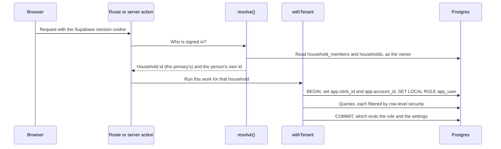

# RetireWise data model

Last reviewed: 2026-10-04

RetireWise keeps every household's finances in one Postgres database on Supabase: 30 tables in eight domains, declared with Drizzle in `src/lib/db/schema.ts` and created by the SQL migrations in `src/lib/db/migrations`. Households are kept apart by row-level security. Each request runs as a restricted role that can see only the rows of the household it signed in to.

This document is half generated. Tables, columns, types, keys, indexes, enums, policies and grants are read from the schema and the migrations on every build, so they cannot drift. What each table is for, what writes it, and the rules the data obeys are written here, and `pnpm datamodel:check` fails CI when the two halves disagree.

One name needs explaining before anything else. `clerk_id` is left over from Clerk, the sign-in provider before Supabase Auth, and now holds a Supabase Auth user id. On almost every table it holds the id of the household's **primary member**, not of whoever is signed in: a partner who joined by invite signs in as themselves, and `src/lib/auth-helpers.ts` maps them to the primary's id before any query runs. No `clerk_id` has a foreign key, because the users live in Supabase's `auth` schema, outside this one.

<!--
How to edit
- Every table in src/lib/db/schema.ts has one "### table_name" entry under "## Tables", and sits in exactly one domain.
- A table entry starts with a list of fields (Written by is required; Read by and Lifecycle are optional),
  then a sentence or two on what one row is, then optionally a list of column notes: "- `column`: note".
- An enum entry has a description, then optionally value notes: "- `value`: note".
- A business rule names what enforces it ("- Enforced by:").
- Name files by their full repository path in backticks. The check fails on a path that does not exist.
- Add a change-log line ("- YYYY-MM-DD · what changed · who") with every change to the schema or to this file.
- `pnpm datamodel:check` validates all of this; `pnpm datamodel:build` writes a preview page.
-->

## Domains

Domains group tables by the job they do for a household. A table belongs to exactly one.

### Households and access

- Tables: households, household_members, household_invites, household_join_attempts

Who belongs to which household, and the invitation machinery that lets a second person join one.

### Investments and linked institutions

- Tables: plaid_items, accounts, holdings, transactions

Investment accounts, the positions and transactions inside them, and the Plaid connections that feed them and the balance sheet.

### Balance sheet

- Tables: real_estate, cash_reserves, vehicles, debts

The assets and liabilities outside investment accounts that make up net worth: property, cash, vehicles and debts.

### Planning inputs and goals

- Tables: user_preferences, contributions, social_security_benefits, goals, goal_links

What the household tells RetireWise about itself (ages, salaries, contributions, Social Security estimates, projection settings) and the goals it measures progress against.

### History and insights

- Tables: portfolio_snapshots, account_snapshots, holding_snapshots, net_worth_snapshots, net_worth_item_history, alerts, ai_analyses

Rows computed from the tables above, mostly by the weekday snapshot job: daily snapshots, per-item value history and alerts. These are the only record of past values; holdings and balances keep only their current state.

### Tax and contribution reference

- Tables: irs_limits, tax_reference

IRS and Medicare figures that are the same for every household and belong to none.

### Billing

- Tables: subscriptions, billing_events

The household's plan and what Stripe last reported, and the record that stops a Stripe event being applied twice. Dormant until Stripe is configured; every household created today is complimentary.

### Operations

- Tables: audit_log, cron_runs

The audit trail of actions that change who can reach a household's data or remove something unrecoverable, and the history of scheduled job runs.

## Tables

### households

- Written by: `createHousehold()` in `src/lib/household.ts`; erasure in `src/lib/account/delete.ts`
- Read by: sign-in resolution in `src/lib/auth-helpers.ts`; invite redemption in `src/lib/invites.ts`

One row per shared household. It exists to map several sign-ins onto one set of data: the member named in `primary_clerk_id` is the id every other row of the household is stored under.

- `primary_clerk_id`: The primary member's Supabase Auth id, which every other table stores as `clerk_id`. Nothing in the database stops one person owning two households (GAP-07).
- `name`: Always "My Household"; nothing renames it.
- `id`: Used only by `household_members` and `household_invites`.

### household_members

- Written by: `createHousehold()` in `src/lib/household.ts` (the primary); `redeemInvite()` in `src/lib/invites.ts` (a joiner); erasure
- Read by: `resolve()` in `src/lib/auth-helpers.ts`, on every request

One row per person in a household. Resolving a sign-in to its household reads this table.

- `clerk_id`: The member's own sign-in id, not the household's.
- `role`: Free text: "primary" for the creator, "member" for anyone who joined by invite.

No unique constraint stops a person belonging to two households; only a check in `redeemInvite()` does (GAP-07). There is no way to leave or remove a member yet (GAP-08).

### household_invites

- Written by: `createInvite()`, `revokeInvite()` and `redeemInvite()` in `src/lib/invites.ts`; erasure
- Read by: `src/app/api/household/invites/route.ts`

One row per invitation a household's primary issues. Only a hash of the code is stored, so a copy of the table is not a set of working invitations. The code itself is shown once, when it is created.

- `code_hash`: SHA-256 of the normalised code. Codes are 16 characters of Crockford base32 from a secure random source (80 bits). Unique. Stripped from the export.
- `code_hint`: The code's last four characters, so pending invites can be told apart.
- `expires_at`: Seven days after issue.
- `used_at`: Set once, by a conditional update that only an unused invite matches, so two people redeeming at once cannot both win.
- `revoked_at`: Set by the primary while the invite is unused.

Status is worked out, never stored: revoked, then used, then expired, otherwise active.

### household_join_attempts

- Written by: `redeemInvite()` in `src/lib/invites.ts`, on every attempt; erasure, through the system role
- Read by: the rate limit in `redeemInvite()`

One row per attempt to redeem an invite, successful or not. It backs the limit of 10 failed attempts per person per rolling hour, held in the database so it works without Redis.

- `clerk_id`: The person attempting to join, by their own sign-in id. Row-level security reads `app.account_id` here, not `app.clerk_id`.

The request role may insert and read these rows but never change or delete them, so a rate-limited person cannot clear their own history. Erasure removes the primary's own attempts only; a partner's attempts are theirs, not the household's.

### plaid_items

- Written by: `src/app/api/plaid/exchange-token/route.ts` (link and relink); the refresh job `src/app/api/cron/refresh/route.ts`; `src/app/api/plaid/sync/route.ts`; `src/app/api/plaid/webhook/route.ts`; disconnect in `src/lib/actions/plaid.ts`; `scripts/rotate-keys.ts`; erasure

One row per Plaid Item: one login at one institution, holding the encrypted access token and the refresh and retry state. Its accounts feed `accounts`, `holdings`, `transactions`, `cash_reserves` and `debts`.

- `item_id`: Plaid's id for the Item. Unique across all households.
- `access_token_encrypted`: AES-256-GCM, key from `PLAID_TOKEN_ENCRYPTION_KEY`, with the previous key also tried while a rotation is under way. Never exported.
- `status`: See `plaid_item_status`. The refresh job tries only `active` and `error` Items whose `next_attempt_at` has passed.
- `consecutive_failures`: Each failure doubles the wait from 15 minutes, up to 12 hours. Eight failures, or a Plaid error only the owner can fix, moves the Item to `requires_reauth`.
- `updated_at`: The Plaid webhook only touches this; it does not trigger a refresh.

Nothing records which member linked an Item (GAP-27).

### accounts

- Written by: `src/lib/actions/accounts.ts` (by hand); `src/lib/plaid/sync.ts` (relink, adopt or create); merge and disconnect in `src/lib/actions/plaid.ts`; `scripts/seed-demo.ts`; erasure

One row per investment account: a 401(k), an IRA, a brokerage account, an HSA and so on, owned by one person in the household. Holdings and transactions belong to an account.

- `plaid_item_id`: Plaid's `item_id` string, not a foreign key to `plaid_items`. A manual "Sync now" can write the database id instead (GAP-05).
- `plaid_account_id`: Plaid's account id. A sync matches an existing account by this first, then adopts an unlinked manual account with the same name and institution, then creates one.
- `data_source`: Back to `manual` when the account is disconnected; both Plaid ids are cleared.
- `is_active`: Nothing writes it, so it is always true.

Deleting an account deletes its holdings and transactions, unlinks its contributions, and leaves its snapshots and any goal links behind (GAP-31).

### holdings

- Written by: `src/lib/actions/holdings.ts` (by hand, and cost basis); `src/lib/actions/import.ts` (file import and Fidelity refresh); `src/lib/plaid/sync.ts`; `src/lib/plaid/investment-transactions.ts` (derived basis); `src/lib/utils/price-feed.ts` (prices); erasure

One row per position in an account: shares, price, value and cost basis as they are now. Past positions live in `holding_snapshots`.

- `account_id`: The only link to a household; row-level security reaches the household through `accounts`.
- `ticker`: For a synced position, the ticker, else the CUSIP, else the name.
- `plaid_security_id`: Plaid's stable id for the security, used to match a position to its transactions when the ticker is re-spelled. Not backfilled for rows synced before it existed.
- `cost_basis_per_share`: Null means not reported, never zero. A file import without a basis column writes zero (GAP-11).
- `cost_basis_source`: Where the basis came from. A `manual` basis outranks every other; see the business rules.
- `current_value`: Always shares times current price, by every writer.

A Plaid sync removes positions Plaid stopped reporting, but first copies the full rows into `audit_log` so a mistaken removal can be undone. Nothing stops two rows with the same ticker in one account.

### transactions

- Written by: the Plaid investment-transaction sync in `src/lib/plaid/investment-transactions.ts`, from the refresh job and `src/app/api/plaid/sync/route.ts`; erasure

One row per investment transaction (a buy, sell, dividend, contribution or fee) in a linked account. Transactions supply the cash flows for time-weighted return, dividend income, and the evidence for a derived cost basis. Nothing manual or imported writes them.

- `plaid_transaction_id`: Unique, and the insert skips a row it has seen, so overlapping syncs cannot count a flow twice.
- `amount`: Signed as Plaid signs it: money leaving the account is positive.
- `holding_id`: Nothing writes it. Transactions are matched to positions when read, by `plaid_security_id` and then ticker.

### real_estate

- Written by: `src/lib/actions/net-worth.ts`; `scripts/seed-demo.ts`; erasure

One row per property: estimated value, the mortgage typed onto it, and whether it is the primary residence.

- `mortgage_balance`: The typed-in loan. Net worth ignores it when a debt is secured against this property, so the loan counts once.

Each create and update also writes `net_worth_item_history`.

### cash_reserves

- Written by: `src/lib/actions/net-worth.ts` (by hand); `src/lib/actions/import-statement.ts` (OFX and QFX statements); `src/lib/plaid/sync.ts` (balances); erasure

One row per cash holding: checking, savings, a CD, I bonds, an emergency fund.

- `data_source`: `csv_import` also marks a row from a bank statement file.
- `plaid_account_id`: A balance sync matches by this, then adopts an unlinked row with the same name.

A statement import refuses a Plaid-linked row, and a statement older than the latest recorded balance, unless forced. Plaid balance syncs do not write item history.

### vehicles

- Written by: `src/lib/actions/vehicles.ts`; `scripts/seed-demo.ts`; erasure

One row per vehicle (car, truck, boat, RV and so on) with its identity, estimated value and any loan typed onto it. Decoding a VIN asks NHTSA but stores nothing extra.

- `loan_balance`: Counts only when `has_loan` is true, and is replaced by any debt secured against the vehicle.

### debts

- Written by: `src/lib/actions/net-worth.ts` (by hand); `src/lib/actions/debt-security.ts` (secured-by link); `src/lib/actions/import-statement.ts`; `src/lib/plaid/sync.ts` (liabilities); erasure

One row per liability: mortgage, auto loan, student loan, HELOC, card and so on.

- `secured_by_type`: With `secured_by_id`, names the property or vehicle the loan is secured against. Set and cleared through an audited action.
- `secured_by_id`: No foreign key, because it points into one of two tables; ownership is checked in code. Deleting the asset does not clear it, and the debt then drops out of net worth (GAP-32).
- `interest_rate`: Zero means not reported: synced and imported debts get zero when the source is silent.
- `monthly_payment`: Zero means not reported, as for the rate.

### user_preferences

- Written by: `src/lib/actions/preferences.ts`; `src/app/api/settings/ai-provider/route.ts`; `src/app/api/settings/projection-controls/route.ts`; `scripts/rotate-keys.ts`; erasure

One row per household of planning settings: ages and retirement ages, salaries and salary growth, filing status, risk tolerance, target allocation, projection settings, and the household's own AI provider keys. Despite the name it belongs to the household and both partners share it.

- `clerk_id`: Unique: one row per household.
- `anthropic_api_key`: Encrypted with AES-256-GCM under a key derived from `ENCRYPTION_KEY`, or from `CRON_SECRET` when that is unset. Only a masked form is ever returned, and the export reports only whether a key exists. The same holds for `google_api_key` and `openai_api_key`.
- `ai_provider`: Can only be set to a provider the household has its own key for.

### contributions

- Written by: `src/lib/actions/contributions.ts`; `scripts/seed-demo.ts`; erasure

One row per recurring contribution line, such as "Matt 401(k) 6%": the employee's percent or amount, frequency, escalation, cap, employer match, non-elective money and vesting. Projections are built from these.

- `account_id`: Optional; set to null when the account is deleted.
- `is_active`: Retiring a line sets this false and records `ended_on`, so past years still explain themselves.
- `paused_from`: A pause is separate from ending a line; a null `resumes_on` means paused until further notice.
- `account_type`: Copied onto the row when it is saved, and not kept in step with the account.

### social_security_benefits

- Written by: `src/lib/actions/social-security.ts`; `scripts/seed-demo.ts`; erasure

One row per person in a household: estimated monthly benefit at 62, at full retirement age and at 70, planned claiming age, spousal benefit and the cost-of-living assumption.

- `owner`: One row per person is kept by the code that saves it; no unique index enforces it.
- `benefit_at_fra`: The one figure the projection uses, with `full_retirement_age`; the claiming age comes from the Projections page.
- `assumed_cola_pct`: Saved, defaulting to 2.5%, but no calculation reads it: the projection raises benefits with the market scenario's inflation (GAP-38).
- `planned_claiming_age`: Saved and never read by a calculation, like `spousal_benefit_amount` and `eligible_for_spousal_benefit` (GAP-38).

### goals

- Written by: `src/lib/actions/goals.ts`; the snapshot job, `src/lib/utils/portfolio-snapshot.ts` (closure); `scripts/seed-demo.ts`; erasure

One row per goal: a target amount, whether to build up to it or pay down to it, an optional target date, and the date its starting point was fixed. Progress is worked out when read, from `goal_links` and the current value of each linked item; it is not stored.

- `closed_at`: Set the first time the goal is met, and never cleared.
- `current_amount`: No longer used: cleared by migration 0017 and written by nothing. The same holds for `is_completed`.

### goal_links

- Written by: `createGoal()` in `src/lib/actions/goals.ts`; migration 0017's backfill; erasure

One row per item a goal is measured over (an investment account, debt, cash reserve, property or vehicle), with that item's balance on the day it was linked. A goal's starting point is the sum of its links' baselines, fixed when the goal is created.

- `item_id`: Points into one of five tables, so there is no foreign key. A link whose item has been deleted drops out of both the baseline and the current total.
- `baseline_amount`: Zero is meaningful: a commitment to keep a card at zero.

### portfolio_snapshots

- Written by: the snapshot job, `src/lib/utils/portfolio-snapshot.ts`; `scripts/seed-demo.ts`; erasure

One row per household per weekday: total investment value, the split between partners, allocation, top holdings and the change since the previous snapshot. The dashboard's value chart and its daily change read this.

- `snapshot_date`: The UTC date. Not unique in the schema; the snapshot job replaces a household's rows for the day before writing, so a second run on one day restates it. Days written before 6 Oct 2026 can still hold two rows.
- `daily_change`: The total less the total of the household's last snapshot from an earlier day: a balance change, so money paid in or taken out counts (#71). `daily_change_pct` is it as a share of that earlier total. Alerts and reports read it; the dashboard's daily change does not, and works out the market's move from `holding_snapshots` instead.
- `ytd_return_pct`: Nothing writes it.

### account_snapshots

- Written by: the snapshot job, `src/lib/utils/portfolio-snapshot.ts`, which replaces the household's rows for the day; erasure, by current account

One row per investment account per weekday: value, cost basis and gain. Period returns on each account card read this.

- `account_id`: No foreign key, so rows outlive the account they describe. Erasure and export look these rows up by the household's current accounts, which misses the rows of an account deleted earlier (GAP-31).
- `cost_basis`: Null when any holding in the account has no known basis; the gain is then null too.

### holding_snapshots

- Written by: the snapshot job, `src/lib/utils/portfolio-snapshot.ts`; erasure

One row per position per account per weekday: shares, price and value. Share counts let a day's change be split into market movement and money paid in, which a time-weighted return needs. The last day's prices before the market day are the previous close the dashboard's daily change is measured from.

- `account_id`: No foreign key.
- `ticker`: Part of the unique key with the account and day; a later run that day updates the row with its shares, price and value.

### net_worth_snapshots

- Written by: `snapshotNetWorth()` in `src/lib/utils/net-worth-snapshot.ts`, called from the snapshot job, from updates to balance-sheet items, from statement imports, and from `src/app/(dashboard)/net-worth/page.tsx` when today has no row; erasure

One row per household per day: net worth and its parts. The net-worth chart reads this. Today's row is replaced each time it is recomputed.

- `total_debts`: Unsecured debts only, despite the name. Gross assets less `total_debts` and `secured_debts` is net worth.
- `real_estate_equity`: Equity basis: value less the loan, like `vehicle_equity` and `total_assets`.
- `real_estate_value`: Gross basis, with `vehicle_value` and `secured_debts`. Added by migration 0019 and null on every earlier row, because that split was never recorded.
- `investment_value`: Outside the weekday job it is the latest portfolio snapshot, which can be days old.

### net_worth_item_history

- Written by: `recordItemHistory()` in `src/lib/utils/record-item-history.ts`, called when a property, cash reserve, debt or vehicle is created or updated by hand or by a statement import; erasure

One row per balance-sheet item per day it changed: the value series behind each item's chart. Plaid syncs and the weekday job do not write it, and it is the only record of an item's past values.

- `item_type`: Free text: real_estate, cash_reserve, vehicle or debt.
- `item_id`: Text, with no foreign key. History stays when its item is deleted.
- `value`: Equity for a property or vehicle; the balance for cash and debts.
- `secondary_value`: Market value for a property or vehicle; null otherwise.

The writes from the manual actions are not awaited, so a failure there is silent.

### alerts

- Written by: `generateAlerts()` in `src/lib/utils/alert-generator.ts`, from the snapshot job; `src/app/api/alerts/dismiss/route.ts` and `src/app/api/alerts/dismiss-all/route.ts`; erasure

One row per portfolio alert: allocation drift, a large daily move or a concentrated holding, with a severity. Generation replaces any undismissed alert of the same type, so at most one is active per type. Nothing shows them today (GAP-25).

- `type`: Only three of the six `alert_type` values are ever generated.

### ai_analyses

- Written by: nothing; erasure deletes it and export reads it

Meant to hold saved AI analyses. No code writes it, and the AI report routes do not save their results, so the table is always empty.

### irs_limits

- Written by: `src/app/api/irs-limits/refresh/route.ts`, through the system role, from figures fixed in that file
- Read by: the contributions settings

Shared reference: IRS contribution limits per tax year and account type, including the age-50 and age 60–63 catch-ups. Any signed-in person can trigger the refresh, though it can only write the figures in the code (GAP-09).

- `account_type`: Free text, not the `account_type` enum.
- `tax_year`: No unique key with the account type; the refresh checks before inserting.

### tax_reference

- Written by: `src/app/api/irs-limits/refresh/route.ts`, from `src/lib/tax/seed.ts`
- Read by: `loadTaxTable()` in `src/lib/tax/load.ts`

Shared reference: federal brackets, IRMAA tiers, the standard deduction and Medicare and healthcare costs per tax year. The loader uses the newest year that is not in the future and passes validation, and falls back to figures built into the code.

- `kind`: Tiered kinds such as brackets and IRMAA tiers use `ordinal` for position and `threshold` for the top of each tier, with null meaning no upper limit. Single figures use ordinal 0.
- `value`: A fraction for a rate, dollars for an amount.

Only married-filing-jointly figures are held.

### subscriptions

- Written by: `src/lib/billing/entitlements.ts` (a complimentary row when a household is created); `src/app/api/billing/checkout/route.ts`; `src/app/api/billing/webhook/route.ts`; erasure

One row per household holding what Stripe last reported (plan, status, period end, customer and subscription ids), plus a flag that grants full access whatever billing says. The plan is resolved in `src/lib/billing/entitlements.ts`, which works without a row.

- `comped`: Every household created today is complimentary ("friends-and-family"), and Stripe events never change a complimentary row.
- `last_event_at`: An event older than this is ignored, which guards against Stripe delivering out of order.

### billing_events

- Written by: `src/app/api/billing/webhook/route.ts`

One row per Stripe webhook event received. It is how the webhook applies each event once: a repeat is acknowledged and skipped, and a failed event's row is removed so Stripe's retry can do the work. Only the system role can reach it. Nothing prunes it.

### audit_log

- Written by: `recordAudit()` in `src/lib/audit.ts`, which never throws; erasure, through the system role
- Read by: nothing in the app yet

One row per action that changes who can reach a household's data or removes something that cannot be recovered: invites, linking and disconnecting banks, storing AI keys, setting a cost basis, securing a debt, positions removed by a sync, and data exports. It deliberately does not log reads.

- `clerk_id`: The household affected. A revoked invite is filed under the household's own id instead, so the household cannot see that row (GAP-19).
- `actor_id`: The person who acted, when the caller passes it. Plaid and AI-key events do not.
- `detail`: For positions removed by a sync, the full rows, so the removal can be undone.

The request role may add and read rows but never change or delete them (#46).

### cron_runs

- Written by: `src/app/api/cron/snapshot/route.ts` and `src/app/api/cron/refresh/route.ts`
- Read by: `src/app/api/health/freshness/route.ts`

One row per scheduled job run, with when it started and finished, whether it succeeded, how many households it processed and how many failed. The snapshot job counts as succeeded only when every household was snapshotted. The freshness check reads it to tell a job that ran and found nothing to do from one that stopped running. Only the system role can reach it.

- `ok`: The weekday snapshot always records true, even when a household failed (GAP-22).
- `finished_at`: Null when a run was killed partway.

## Enums

### account_owner

Which person in the household a row belongs to. A label on the row; it is not linked to `household_members`.

- `self`: The primary person.
- `spouse`: Their partner.

### account_type

The kind of investment account. Plaid subtypes map onto five of these, and anything unrecognised becomes `brokerage`.

- `social_security`: Offered by the account form. Benefit estimates themselves live in `social_security_benefits`.

### tax_treatment

How an account is taxed. Inferred from the account type for accounts Plaid creates.

- `tax_deferred`: Traditional 401(k) or IRA: tax is paid on withdrawal.
- `tax_free`: Roth or HSA.
- `taxable`: A brokerage account.

### data_source

How a row's figures arrived.

- `csv_import`: A holdings file, and also an OFX or QFX bank statement for cash and debts.

### cost_basis_source

Where a holding's cost basis came from. Null alongside a null basis.

- `plaid`: Reported by the institution.
- `manual`: Typed in by the owner from a statement. Outranks the others; a sync or a derivation never replaces it.
- `derived`: Rebuilt from transactions, only when the record proves it.

### asset_class

The allocation bucket a holding counts toward.

### transaction_type

What an investment transaction did, mapped from Plaid's type and subtype. Plaid's cancellations and bare cash rows are dropped.

- `dividend`: Also capital-gain distributions and interest.
- `split`: Also stock distributions.

### risk_tolerance

The household's stated appetite for risk, on `user_preferences`.

### filing_status

Federal filing status for tax calculations. The tax reference holds only married-filing-jointly figures.

### contribution_method

How the employee's contribution is expressed.

- `percent_of_salary`: Uses `contribution_percent`.
- `fixed_amount`: Uses `contribution_amount` per period of `contribution_frequency`.

### contribution_frequency

How often a fixed contribution is made.

### vesting_schedule

How employer money becomes the employee's.

- `cliff`: All of it after `vesting_years`.
- `graded`: In steps over `vesting_years`.

### plaid_item_status

The state of a Plaid connection.

- `active`: Healthy.
- `error`: Recent failures; still retried, with a growing wait.
- `requires_reauth`: Only the owner can fix it by reconnecting; the refresh job stops trying.

### debt_type

The kind of liability. Plaid credit accounts become `credit_card`; loan subtypes map to the rest.

### debt_security

What a debt can be secured against, in `debts.secured_by_type`.

### cash_account_type

The kind of cash holding. Plaid depository subtypes map to checking, savings, money market or CD, otherwise `other_cash`.

### vehicle_type

The kind of vehicle.

### goal_direction

How a goal's progress counts.

- `accumulate`: Grow from the starting point up to the target.
- `reduce`: Pay a balance down from the starting point to the target.

### goal_item_type

What a goal link points at.

- `account`: An investment account.

### alert_type

The kind of alert. Only three are generated.

- `allocation_drift`: Generated: allocation more than 5 points from target, critical above 10.
- `large_daily_move`: Generated: a move of more than 2% in a day, critical above 5%.
- `concentration_risk`: Generated: one holding over 25% of the portfolio, critical above 40%.
- `milestone_reached`: Not generated; appears only in the demo data.

### alert_severity

How loudly an alert speaks.

### analysis_type

The kind of saved AI analysis, for `ai_analyses`, which nothing writes.

## Business rules

Rules the data obeys, and what holds each one in place. Where only application code enforces a rule, the database would accept a row that breaks it.

### Every household's rows are filed under its primary member's id

- Enforced by: row-level security policies comparing `clerk_id` with `current_setting('app.clerk_id', true)`; `resolve()` in `src/lib/auth-helpers.ts`
- Verified by: `scripts/test-rls.ts`

A partner's sign-in is mapped to the primary's id before any query runs. When the setting is missing the comparison is with null, so a query that forgot to set it returns nothing rather than everything.

### Holdings and transactions reach a household only through their account

- Enforced by: the `holdings_tenant` and `transactions_tenant` policies; foreign keys to `accounts` that cascade on delete
- Verified by: `scripts/test-rls.ts`

Neither table has a household column, so deleting an account deletes both.

### Erasure deletes every row about the household

- Enforced by: `deleteHouseholdData()` in `src/lib/account/delete.ts`; `src/app/api/account/delete/route.ts` (primary only, typed confirmation)
- Verified by: `scripts/test-account-data.ts`

Children before parents, every table named rather than left to a cascade. The audit log and join attempts are deleted through the system role, on its own connection, because the request role may not delete them. Snapshots of accounts deleted before erasure are missed (GAP-31).

### Invite codes are stored only as hashes, and are single-use, expiring and revocable

- Enforced by: the unique `code_hash`; `src/lib/invites.ts`; `src/app/api/household/invites/route.ts`
- Verified by: `scripts/test-invites.ts`

### Invite redemption is rate-limited in the database

- Enforced by: `redeemInvite()` in `src/lib/invites.ts`, counting `household_join_attempts`; `src/app/api/household/join/route.ts`
- Verified by: `scripts/test-invites.ts`

Ten failures in an hour and the person is refused. Every failure gets the same answer, so the endpoint cannot be used to find out which codes exist.

### The application can add to the audit log and join attempts but never change them

- Enforced by: grants of SELECT and INSERT only to the request role on `audit_log` and `household_join_attempts`

### Secrets are encrypted at rest and never exported

- Enforced by: `src/lib/plaid/encryption.ts`; `src/lib/utils/encryption.ts`; `src/lib/crypto/keyring.ts`; `src/lib/account/export.ts`
- Verified by: `scripts/test-account-data.ts`, `scripts/test-ops.ts`

Plaid access tokens and the household's AI keys are sealed with AES-256-GCM. Ciphertext is versioned, decryption also tries the previous key, and `scripts/rotate-keys.ts` re-seals stored values under a new one.

### A cost basis is never invented, and one typed in by hand outranks a synced one

- Enforced by: `resolveBasisUpdate()` in `src/lib/plaid/sync.ts`; `src/lib/plaid/investment-transactions.ts`; `src/lib/utils/cost-basis.ts`
- Verified by: `scripts/test-cost-basis.ts`, `scripts/test-investment-transactions.ts`

A sync never replaces a manual basis, and Plaid's silence leaves an existing basis alone. A basis is derived only for a position with no basis whose transactions prove it. An account snapshot records no basis when any position's is unknown. The holdings file import breaks this rule: it writes zero when the file has no basis, and replaces a manual basis (GAP-11).

### A Plaid transaction is stored once

- Enforced by: the unique index on `transactions.plaid_transaction_id`, with the insert skipping a row it has seen

### A holding snapshot is written once per account, day and ticker

- Enforced by: the unique index `holding_snapshots_unique_idx`, with the insert skipping a row it has seen

### Net-worth snapshots and item history keep one row per day

- Enforced by: delete-then-insert in `src/lib/utils/net-worth-snapshot.ts` and `src/lib/utils/record-item-history.ts`

Code only: no unique index backs it, so two writers at the same moment could both insert. Portfolio and account snapshots have no such rule and a second run duplicates them (GAP-22).

### Each liability counts once in net worth

- Enforced by: `composeNetWorth()` in `src/lib/net-worth/compose.ts`; ownership checks in `src/lib/actions/debt-security.ts`
- Verified by: `scripts/test-net-worth.ts`, `e2e/debt-security.spec.ts`

A debt secured against an asset replaces the loan typed onto that asset. A debt secured against an asset that has since been deleted is counted nowhere (GAP-32).

### A goal's starting point is fixed when it is created, and reaching it is permanent

- Enforced by: `src/lib/actions/goals.ts`; `src/lib/goals/progress.ts`; the snapshot job; the unique index `goal_links_unique_idx`
- Verified by: `scripts/test-goals.ts`

A goal needs at least one linked item. Editing a goal cannot change its links or starting point.

### Contribution lines are retired or paused, not deleted

- Enforced by: `src/lib/actions/contributions.ts`

So a past year's projection still explains itself. A hard delete exists for lines entered by mistake.

### One settings row and one subscription row per household

- Enforced by: unique `user_preferences.clerk_id` and `subscriptions.clerk_id`; `src/lib/actions/social-security.ts` for one Social Security row per person

The Social Security rule is held by code alone.

### Tax and IRS reference data is shared and read-only to households

- Enforced by: grants of SELECT only and read-for-all policies; writes only through the system role in `src/app/api/irs-limits/refresh/route.ts`
- Verified by: `scripts/test-tax-reference.ts`

### Stripe events apply once, in order, and never to a complimentary household

- Enforced by: the unique `billing_events.stripe_event_id`; `src/app/api/billing/webhook/route.ts`

### A failing bank connection backs off, and stops only when a person must act

- Enforced by: `src/lib/plaid/backoff.ts`; `src/app/api/cron/refresh/route.ts`
- Verified by: `scripts/test-ops.ts`

### The demo household cannot be changed

- Enforced by: the write guards in `src/lib/auth-helpers.ts`; `scripts/seed-demo.ts` seeds it

Its rows are filed under a fixed id. The price refresh has no write guard and updates the demo's prices (GAP-09).

## Derived data

What is computed from other tables, when, and whether it can be rebuilt. Snapshot dates are UTC dates; timestamps are stored without a time zone. The weekday snapshot runs at 22:00 UTC (6 PM Eastern in summer) and the bank refresh at 10:00 UTC daily, both from `vercel.json`.

### `portfolio_snapshots`, `account_snapshots` and `holding_snapshots`

- Source: holdings and accounts, after a price refresh
- Written: the weekday snapshot job, for households holding investments
- Rebuildable: only for today. Holdings keep no history, so a missed day is lost.

The job runs through the system role without a transaction, so a failure partway through leaves a partial day.

### `net_worth_snapshots`

- Source: properties, cash, vehicles and debts, plus the day's investment total, composed by `src/lib/net-worth/compose.ts`
- Written: the weekday job; any update to a balance-sheet item; statement imports; opening the net-worth page when today has no row
- Rebuildable: only for today. Gross-basis columns before migration 0019 are null by design.

### `net_worth_item_history`

- Source: the item's own row when it is saved
- Written: manual creates and updates, and statement imports; never by Plaid or the weekday job
- Rebuildable: no. It is the only record of an item's past values.

### `alerts`

- Source: holdings, the target allocation, and the latest portfolio snapshot
- Written: the weekday job
- Rebuildable: yes for current conditions; which alerts were dismissed is not.

### Goal closure

- Source: goal progress from `goal_links` and current values
- Written: the weekday job sets `goals.closed_at`
- Rebuildable: no. It records a moment.

### Prices and values on `holdings`

- Source: Yahoo Finance quotes, cached in Upstash Redis, or the price Plaid reports
- Written: the weekday job, `src/app/api/prices/refresh/route.ts`, and every Plaid sync
- Rebuildable: yes, by fetching again.

### Derived cost basis

- Source: a position's transactions
- Written: the daily bank refresh, after every connection, and a manual sync
- Rebuildable: yes, under the same proof conditions.

### Tax and IRS reference

- Source: figures in `src/app/api/irs-limits/refresh/route.ts` and `src/lib/tax/seed.ts`
- Written: the refresh route, by hand, once a year (`docs/annual-tax-update.md`)
- Rebuildable: yes, completely.

## Security model

The database keeps households apart; application code does not have to remember to. Each request runs as `app_user`, a role that owns nothing and cannot bypass row-level security, inside a transaction that carries the household's id. Every policy compares a row's household key with that id.

- **Two roles.** The app connects as the table owner, which bypasses row-level security. Migration 0009 created `app_user` without login and without the right to bypass, and let the owner switch to it. Default privileges are not set, so every new table needs its own grant and policy in its migration; `pnpm datamodel:check` fails when a household table has no policy.
- **`withTenant`** in `src/lib/db/tenant.ts` opens a transaction, sets `app.clerk_id` (the household) and `app.account_id` (the person), and switches to `app_user`, all for that transaction only. Supabase's pooler hands connections between clients between transactions, so a session-wide setting would leak one household into the next request. Routes and actions enter it through the wrappers in `src/lib/auth-helpers.ts`, and `scripts/check-tenant-scope.ts` fails CI when a new entry point that touches the database does not.
- **`withSystemRole`** runs as the owner with no transaction and no row-level security, and names its reason. It is for the scheduled jobs, the Stripe and Plaid webhooks, health checks, the tax-reference refresh, a manual bank sync after the household is resolved from the session, and erasing the two append-only tables.
- **Household keys.** Most tables carry `clerk_id`. `holdings` and `transactions` are reached through `accounts`; `household_members` and `household_invites` through `households`. `household_join_attempts` is keyed by the person, not the household. `irs_limits` and `tax_reference` are shared reference that the request role can only read. `billing_events` and `cron_runs` are system records the request role cannot reach at all.
- **The public API is closed.** Supabase exposes tables through its REST API to holders of the publishable key. No policy admits the `anon` or `authenticated` roles, so that API returns nothing.
- **Known exceptions.** Some routes still query as the owner and rely on their own `clerk_id` filters: the AI chat and its tools, the price refresh, the billing status, and the household create, invite and join routes (GAP-06, #33). The join route needs the owner by design, because it reads a household the person is not in yet.

## Verification

- **Check this document:** `pnpm datamodel:check`, in CI. It fails when a table or enum is undescribed or in no domain, a note names a column that does not exist, a named file is missing, the schema and migrations declare different indexes, or a household table has no row-level security policy.
- **Change the schema:** edit `src/lib/db/schema.ts`, run `pnpm db:generate`, and review the SQL it writes. Policies and grants are written by hand in the migration, since the schema declares neither. Until the stored snapshot is repaired, `pnpm db:generate` also re-emits migrations 0017 to 0019, which must be deleted from its output (#60).
- **Apply migrations:** `pnpm db:migrate` locally, `pnpm db:migrate:ci` in CI. Production migrations are applied separately; `pnpm deploy:prod` does not run them (`docs/disaster-recovery.md`).
- **Seed the demo household:** `pnpm db:seed-demo`.
- **Isolation:** `pnpm test:rls` proves that statements under `withTenant` run as `app_user` and see only their own household, that holdings are scoped through accounts, and that the role does not outlive its transaction.
- **Export and erasure:** `pnpm test:account-data` finds every table with a household key from the database itself, and fails when one is missing from the export or keeps rows after erasure. It also fails when a secret or invite hash appears in an export.
- **Invites:** `pnpm test:invites` covers code strength, the rate limit, single use, expiry and revocation.
- **Rules in code:** `pnpm test:cost-basis`, `test:investment-transactions`, `test:goals`, `test:net-worth`, `test:ofx-import`, `test:tax-reference` and `test:ops` run without a database.
- **Rotate keys:** `pnpm keys:rotate:dry`, then `pnpm keys:rotate`.

The database checks need a migrated Postgres; CI starts one for the "Mobile layout" job in `.github/workflows/ci.yml`.

## Change log

- 2026-10-03 · First version: 30 tables in eight domains, 22 enums, 19 business rules, derived data and the security model; the page is generated from the schema and migrations with this document, and `pnpm datamodel:check` keeps them in step · Claude
- 2026-10-03 · Declared `debts_secured_by_idx` in the schema, which migration 0018 had created without it; corrected the schema comment on `net_worth_item_history`, which had value and secondary value the wrong way round; opened GAP-31, GAP-32 and #60 from defects found while writing this · Claude
- 2026-10-04 · `social_security_benefits`: said which fields the projection reads and which it ignores (GAP-38), found while writing How RetireWise works · Claude
- 2026-10-06 · The snapshot tables are written by `src/lib/utils/portfolio-snapshot.ts`, one set per household per day, with the daily change measured from the previous day (#49); `daily_change` explained; `cron_runs` records failed households · Claude
- 2026-10-06 · `holding_snapshots` prices are the previous close for the dashboard's daily change, which no longer reads `portfolio_snapshots.daily_change` (#79) · Claude
