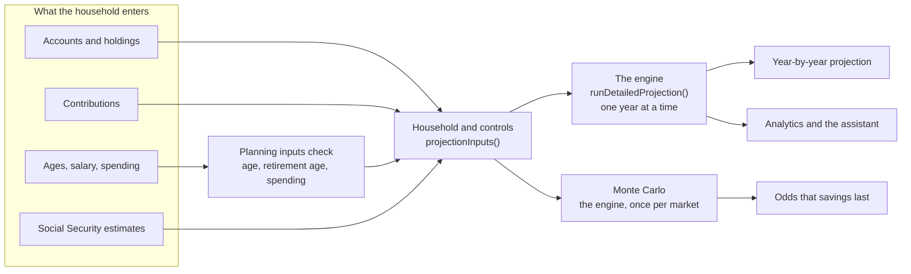

# How RetireWise works

Last reviewed: 2026-10-04

RetireWise answers one question above all: will the money last? It answers it with a single projection engine that walks a household's accounts forward one year at a time, then runs that same engine against {{mc.simulations}} simulated markets to give the odds. Every other figure in the app, from net worth to a holding's gain, comes from a small, named calculation, and each one is explained below.

This page runs the production engine. The calculators are the code that is live in the app, bundled from the same commit, so changing an input here recalculates exactly as the Projections page would. Every number quoted in the text is read from that code when the page is built.

<!--
How to edit
- Explain each calculation under a "### Title" entry: a sentence on the question it answers, the formula in a ```formula fence, then the fields:
  "- Code:" a file in backticks followed by the functions in it, in backticks; another file, its functions; and so on.
  "- Checked by:" the scripts or specs CI runs that prove it.
  "- Shown in:" where a household sees the result.
- Never type a figure the code holds. Write {{key}}; `pnpm how:check` lists the keys and fails on one it does not know.
- Place a calculator with a ```widget fence holding its name: playground, year, ss-claiming, tax, rmd, glide-path, monte-carlo, withdrawal-order, assumptions.
- Every function exported from a calculation module needs a row in the code map.
- Add a change-log line ("- YYYY-MM-DD · what changed · who") with every change.
-->

## The big picture

What a household enters becomes a set of inputs; one engine turns the inputs into a year-by-year projection; the same engine, run against many markets, gives the odds. Analytics, the assistant and the Projections page all take their figures from that one engine, so they cannot disagree.



Nothing is projected on a guess. Until the household has given its age, its retirement age and what it expects to spend, every projection asks for the missing figure instead of assuming one.

## Try it

An example household, with nothing real in it. Change any figure and the engine runs again, here in the page, in the same way the Projections page runs it: the steady line uses the scenario's average return every year, and the bands come from {{mc.simulations}} simulated markets.

```widget
playground
```

The steady market is what the Projections page draws as its main line. The odds are the share of simulated markets in which savings are still above zero at the end of the horizon. The bars below the chart show, for each year of retirement, what is spent and where it comes from: Social Security first, then savings, with the federal tax on those withdrawals paid out of savings too.

## The projection, year by year

The engine keeps each account separately and steps forward one year at a time, from the household's current age to the end of retirement: the years until retirement plus the years in retirement ({{default.retirementYears}} unless the household chooses otherwise). Everything is in nominal dollars, the dollars of the year in question, so a figure 20 years out includes 20 years of inflation. Each year is labelled with the age reached at its end.

### Inputs: from what the household entered to what the engine takes

- Code: `src/lib/projections/household.ts` `projectionSetupFromRows`, `src/lib/projections/build-accounts.ts` `buildProjectionAccounts`, `src/lib/projections/settings.ts` `controlsFromSaved` `projectionInputs`, `src/lib/planning-inputs.ts` `missingPlanningInputs` `givenMonthlySpending` `describeMissing`
- Checked by: `scripts/test-missing-inputs.ts`, `scripts/test-one-engine.ts`
- Shown in: the Projections page; the assistant's retirement projection

The household's accounts, holdings and contribution records become one engine account each: its balance is the sum of its holdings, its contributions come from the records linked to it that are still in force, and its salary and retirement year are its owner's. The Projections page's controls (claiming ages, spending, scenario, method, horizon, glide path) are added with their defaults where none were saved: the {{default.scenario}} scenario, {{default.retirementYears}} years of retirement, and a {{default.withdrawalRate}} withdrawal rate when a rate is used. If the age, the retirement age or the spending is missing, the engine is not run at all.

### 1. Growth

- Code: `src/lib/utils/projection-scenarios.ts` `runDetailedProjection`
- Checked by: `scripts/test-one-engine.ts`, `scripts/test-analytics.ts`

```formula
balance at year end = balance at year start × (1 + r) + contributions − withdrawals
r = the scenario's return, or the glide path's return at this age
```

Every account earns the same return in a given year, on its balance at the start of the year. Contributions are added at the end of the year, and withdrawals are taken at the end of the year after its growth. In the Monte Carlo, r is drawn at random for each year instead.

### 2. Contributions

- Code: `src/lib/utils/projection-scenarios.ts` `runDetailedProjection`, `src/lib/projections/build-accounts.ts` `buildProjectionAccounts`, `src/lib/utils/salary-growth.ts` `getSalaryAtYear`, `src/lib/utils/contributions.ts` `employeeAnnual` `fundedFractionOfYear`, `src/lib/constants.ts` `getIrsLimitForAge`
- Checked by: `scripts/test-analytics.ts`, `scripts/test-one-engine.ts`
- Shown in: the Projections page; Settings, Contributions

Contributions stop in the year their owner retires. Only records still in force count, and the first of them sets whether the account is funded as a percentage of salary or as an amount:

```formula
salary(y)     = salary today × (1 + raise)^y
deferral %(y) = deferral % + escalation × y                       (a percentage)
employee      = deferral %(y) × salary(y)
employee      = yearly amount + increase × y                      (an amount)
deferral %(y) = employee ÷ salary(y)
match         = min(deferral %(y), matched-up-to %) × salary(y) × match rate
non-elective  = non-elective % × salary(y)            (or a flat amount)
paused share  = the part of the year a pause covers
employee'     = min(employee × (1 − paused share), IRS limit at the owner's age)
contribution  = employee' + match × (1 − paused share) + non-elective
```

An amount is the per-paycheck amount times the paychecks in a year. Its match is worked out the same way as a percentage's, from the amount as a share of pay, and the engine is given the employee's deferral alone, so employer money is never counted twice or capped with it. The IRS limit applies to the employee's own deferral only, never to employer money: {{irs.401k.under50}} for a 401(k) under 50, {{irs.401k.over50}} from 50 and {{irs.401k.60to63}} from 60 to 63 when catch-up is on. A pause stops the employee's money and the match earned on it, for the part of each year it covers, and the contribution resumes on its resume date; non-elective employer money is paid regardless.

### 3. Retirement spending

- Code: `src/lib/utils/projection-scenarios.ts` `runDetailedProjection`

```formula
price level P(y) = (1 + inflation)^(years from today)
spending(y)      = monthly spending today × 12 × P(y)
```

Spending is entered in today's dollars and inflated from today, not from the first year of retirement, so a household 15 years from retiring needs 15 years of inflation more than it spends today before retirement even starts.

### 4. Social Security in the projection

- Code: `src/lib/projections/settings.ts` `projectionInputs`, `src/lib/utils/projection-scenarios.ts` `adjustSSBenefit`, `src/lib/utils/financial-analytics.ts` `ssBenefitAtClaimingAge`

```formula
each benefit       = monthly benefit at full retirement age × share for the claiming age
Social Security(y) = Σ each claimed benefit × 12 × P(y)      each from the year its owner claims it
```

Each partner's benefit starts in the year that partner claims it, so a couple claiming at 62 and 70 is paid one benefit from 62 and both from 70. Benefits are entered in today's dollars, from each person's SSA statement, and rise with the scenario's inflation, which stands in for the cost-of-living adjustment. They are used only in retirement years, to reduce what savings must provide.

### 5. Withdrawals and their tax

- Code: `src/lib/utils/projection-scenarios.ts` `runDetailedProjection` `projectedIncomeTax` `taxableSocialSecurity`
- Checked by: `scripts/test-projection-tax.ts`

```formula
need(y)    = max(0, spending(y) − Social Security(y))
gross G(y) = the withdrawal that leaves need(y) after its own federal tax     (found by iteration)
withdrawal = max(G(y), required minimum distribution)
```

Savings provide what Social Security does not, and the federal tax on the withdrawal comes out of savings too, so the engine grosses the need up: it guesses a withdrawal, works out its tax, adds the tax to the need, and repeats until the answer stops moving by more than 50 cents. The required distribution is taken first from tax-deferred accounts; the rest of the withdrawal comes from every account in proportion to its balance. Only the tax-deferred part is taxed, together with the share of Social Security that income makes taxable.

There are two other ways to set the withdrawal. "A fixed rate of savings" takes a percentage of each year's balance, so it falls when markets do. "Whichever is higher" takes the larger of the two. A cap on withdrawals can be set, but it never pushes a withdrawal below the required distribution.

### 6. Required distributions that are not needed

- Code: `src/lib/utils/projection-scenarios.ts` `runDetailedProjection`, `src/lib/utils/financial-analytics.ts` `calculateRMD`
- Checked by: `scripts/test-projection-tax.ts`, `scripts/test-rmd.ts`

From {{rmd.start}}, the tax-deferred balance must pay out at least its required distribution, whatever the household spends. When the distribution is more than the need, the extra is taxed and then reinvested in the household's largest taxable account (or a new one, if it has none). It leaves the tax-deferred account; it does not leave the family.

### 7. What each year records

- Code: `src/lib/utils/projection-scenarios.ts` `runDetailedProjection`

Each year records the age, the phase, every account's balance, the total, the contributions, the withdrawal, its federal tax, the required distribution, anything reinvested, the tax-deferred balance, the spending, Social Security and the year's price level. Money is in each year's own dollars; Social Security is also kept in today's dollars, as the SSA quotes it, and dividing any figure by the price level restates it in today's dollars. The Projections page's "First Year of Retirement" card does that, setting what savings pay after tax plus Social Security against the spending entered.

Take any year of the example household apart. Every line is the engine's own result for that year; market growth is the difference that makes the year balance.

```widget
year
```

## Social Security

### Claiming age

- Code: `src/lib/utils/financial-analytics.ts` `ssBenefitAtClaimingAge`, `src/lib/utils/projection-scenarios.ts` `adjustSSBenefit`
- Checked by: `scripts/test-one-engine.ts`, `scripts/test-analytics.ts`
- Shown in: the Projections page's claiming-age controls; Analytics

```formula
claiming early, m months before full retirement age:
  share = 1 − {{ss.early1}} × min(m, 36) − {{ss.early2}} × max(0, m − 36)
claiming late, after full retirement age, up to 70:
  share = 1 + {{ss.delayed}} × years delayed
```

This is the Social Security Administration's rule. With a full retirement age of 67, claiming at 62 pays {{ss.at62}} of the full benefit and waiting to 70 pays {{ss.at70}}.

```widget
ss-claiming
```

### How much of it is taxed

- Code: `src/lib/utils/projection-scenarios.ts` `taxableSocialSecurity`
- Checked by: `scripts/test-projection-tax.ts`

```formula
provisional income = other taxable income + ½ × benefits
taxed share        = nothing below {{ss.taxFrom}} of provisional income
                     {{ss.taxMid}} of the excess above it, up to half the benefits
                     more steeply above {{ss.tax85From}}, up to {{ss.taxMax}} of the benefits
```

This is the IRS worksheet for a married couple filing jointly. Its thresholds are fixed in law and have never been indexed, so the engine keeps them in nominal dollars every year while the tax brackets rise with inflation.

## Taxes

### Federal income tax

- Code: `src/lib/utils/financial-analytics.ts` `estimateTaxMFJ` `getMarginalRate` `getRemainingInBracket`, `src/lib/utils/projection-scenarios.ts` `projectedIncomeTax`
- Checked by: `scripts/test-projection-tax.ts`, `scripts/test-analytics.ts`
- Shown in: the Projections page's year table; Analytics

```formula
income         = tax-deferred withdrawals + taxable Social Security
tax this year  = brackets( income ÷ P − standard deduction ) × P
```

The tax is figured in today's dollars and inflated back: the year's income is deflated by the price level, the standard deduction ({{tax.deduction}}) is taken off, the brackets ({{tax.brackets}}) are applied, and the result is inflated. This is the same as raising every bracket and the deduction with inflation each year, as the IRS does. Only married filing jointly is modelled. Withdrawals from taxable and Roth accounts are not taxed, so there is no capital-gains tax, and nothing is taxed while the household is still saving.

```widget
tax
```

### The tax table and its year

- Code: `src/lib/tax/table.ts` `buildTaxTable` `taxTableFreshness`, `src/lib/tax/load.ts` `loadTaxTable` `selectTaxTable`
- Checked by: `scripts/test-tax-reference.ts`
- Shown in: Analytics, with the year it uses

The brackets, deduction and Medicare figures live in a table that names its year, loaded from the database and checked strictly: a year with any piece missing is rejected, and the newest complete year that is not in the future is used. When no year passes, the figures built into the code ({{tax.year}}) are used and the page says so. The Projections page and the assistant's projection always use the built-in figures today (#61).

## Required minimum distributions

From {{rmd.start}}, the IRS requires a share of every tax-deferred account to come out each year, and be taxed, whether or not it is needed.

### The required distribution

- Code: `src/lib/utils/financial-analytics.ts` `calculateRMD` `projectRMDs`
- Checked by: `scripts/test-rmd.ts`
- Shown in: the Projections page's year table; Analytics

```formula
required distribution = tax-deferred balance ÷ divisor for the age      from {{rmd.start}}
```

The divisors come from the IRS Uniform Lifetime Table: {{rmd.divisor.73}} at 73, {{rmd.divisor.80}} at 80, {{rmd.divisor.90}} at 90. The engine works out one distribution on the household's combined tax-deferred balance at the primary person's age.

```widget
rmd
```

## Markets and the odds

### Market scenarios

- Code: `src/lib/utils/projection-scenarios.ts` `runDetailedProjection`
- Shown in: the Projections page's scenario buttons

Each scenario is a return, a volatility and an inflation rate: {{scenario.count}} of them, from {{scenario.moderate.name}} ({{scenario.moderate.return}} a year, {{scenario.moderate.inflation}} inflation), the default, to {{scenario.lost_decade.name}} ({{scenario.lost_decade.return}}) and {{scenario.stagflation.name}} ({{scenario.stagflation.return}} with {{scenario.stagflation.inflation}} inflation). The returns are nominal. The steady projection earns the scenario's return every year; the volatility is used only by the Monte Carlo.

### Glide path

- Code: `src/lib/utils/glide-path.ts` `getGlidePathParams` `generateGlidePathSchedule` `getDefaultGlidePathConfig`
- Shown in: the Projections page, when the glide path is on

```formula
t        = (age − shift start) ÷ (shift end − shift start)        0 before, 1 after
t        = t²                                                    for "slow, then faster"
return   = start profile's return + (end profile's return − start profile's return) × t
```

Like a target-date fund, a glide path moves from a riskier mix to a safer one as retirement approaches. Each profile is a mix of stocks and bonds with an expected return and volatility; between the two ages the engine blends them, and the Monte Carlo blends the volatility too.

```widget
glide-path
```

### The odds that savings last

- Code: `src/lib/projections/monte-carlo.ts` `runProjectionMonteCarlo` `seededRandom`
- Checked by: `scripts/test-one-engine.ts`
- Shown in: the Projections page; the assistant

```formula
for each of {{mc.simulations}} markets:
  each year's return = expected return + volatility × z,   z drawn from a standard normal distribution
  run the engine with those returns
success  = the share of markets in which savings are above zero at the end
bands    = the 10th, 25th, 50th, 75th and 90th percentile balance of each year
```

Each simulated market is the engine itself, given a different return for every year: taxes, required distributions, claiming ages and contribution limits are the engine's own, not a simplified second model of them. The random numbers come from a seeded generator (mulberry32, seed {{mc.seed}}), so the same household gets the same odds on every visit, in the browser and on the server, and a what-if scenario is compared against the same markets as the base case rather than different luck.

The example household under each market scenario:

```widget
monte-carlo
```

### What-if scenarios

- Code: `src/lib/projections/what-if.ts` `whatIfParams`
- Checked by: `scripts/test-one-engine.ts`
- Shown in: the Projections page's scenario analysis

Each what-if is the household's own engine inputs with one thing changed, run against the same simulated markets as the base case, so it differs from the base case only by what it says it changes.

| What-if | What changes in the engine's inputs |
|---|---|
| Market crash, {{whatif.market_crash}} | Every account loses that share today. |
| Retire earlier, {{whatif.early_retire}} | Your contributions stop and withdrawals start that much sooner; the plan ends at the same age. A working partner keeps contributing, and Social Security stays at the claiming ages chosen on the page. |
| Boost savings, {{whatif.boost_savings}} | Your own deferral rises by that share, as a percentage of pay or as an amount. The engine works out the larger match and applies the IRS limit, so a boost can be partly capped. |
| Lower returns, {{whatif.lower_returns}} | Markets return that every year. The glide path is set aside, since it would replace the return with each age's own. |
| High inflation, {{whatif.high_inflation}} | Spending, Social Security and the tax brackets rise at that rate. |
| Reduced Social Security, {{whatif.reduced_ss}} | Every benefit is cut by that share from the day it starts. |

Retiring earlier usually lowers a Social Security benefit too, since it is based on years of earnings; the app has no earnings record, so it does not model that.

## Retirement analytics

The Analytics page and the assistant's analytics tool answer narrower questions than the projection: when to claim, how much to convert to Roth, what fees cost. Each is a calculator of its own, simpler than the engine. Only the balances they start from come from the engine.

### Balances at retirement

- Code: `src/lib/projections/at-retirement.ts` `balancesAtRetirement`
- Checked by: `scripts/test-one-engine.ts`
- Shown in: Analytics; the assistant's analytics tool

```formula
today          = holdings summed by account type: tax-deferred, tax-free (Roth and HSA), taxable
at retirement  = the engine's balance in the last working year
return         = from the household's risk tolerance: {{risk.conservative}}, {{risk.moderate}} or {{risk.aggressive}}
```

The engine runs on the household's own accounts and contributions, with the return its risk tolerance implies and {{atRetirement.inflation}} inflation, and the balance it reaches when work stops is where every Analytics tab begins. That balance is in the dollars of the retirement year. Accounts are sorted by their type here, not by the tax treatment the rest of the app uses.

### What the Analytics page assumes

The page passes a few fixed assumptions to most of its calculators. They are part of the answer, so they are listed here.

| Assumption | Value | Used by |
|---|---|---|
| Share of Social Security that is taxable | {{analytics.ssTaxed}}, of the benefit at full retirement age | required distributions, the Roth ladder, tax |
| Withdrawal from savings | {{analytics.withdrawal}} of the balance at retirement | tax, income replacement, healthcare |
| Inflation | {{analytics.inflation}} | sequence of returns, healthcare |
| Years projected | {{analytics.years}} | required distributions, sequence of returns, healthcare |
| Highest bracket to convert into | {{analytics.rothTarget}} | the Roth ladder |

The engine works these out instead: it taxes Social Security with the IRS worksheet, uses the claiming ages saved on the Projections page, and figures tax in each year's own dollars. Analytics sets a balance in future dollars beside spending, salary, Social Security and tax brackets in today's dollars, which overstates income and tax for a household more than a few years from retiring (#72).

### Required distributions, year by year

- Code: `src/lib/utils/financial-analytics.ts` `projectRMDs` `calculateRMD`
- Checked by: `scripts/test-rmd.ts`, `scripts/test-analytics.ts`, `scripts/test-tax-reference.ts`
- Shown in: Analytics, the required distributions tab; the assistant

```formula
each year from retirement:
  distribution = tax-deferred balance ÷ divisor for the age        nothing before {{rmd.start}}
  its tax      = tax(other income + distribution) − tax(other income)
  next balance = (balance − distribution) × (1 + return)
other income   = {{analytics.ssTaxed}} of the couple's Social Security, the same every year
```

The tax is what the distribution adds on top of the household's other income, so it is charged at the household's top rates, not its average. The page's headline figures are the first year at or after {{rmd.start}}.

### Roth conversion ladder

- Code: `src/lib/utils/financial-analytics.ts` `calculateRothConversionLadder` `getMarginalRate`
- Checked by: `scripts/test-analytics.ts`, `scripts/test-tax-reference.ts`
- Shown in: Analytics, the Roth tab; the assistant

```formula
top of the target = the top of the highest bracket taxed at {{analytics.rothTarget}} or less
each year from retirement until the year before {{rmd.start}}:
  both balances grow by the return
  room     = max(0, top of the target − max(0, other income − standard deduction))
  convert  = min(room, traditional balance)
  its tax  = tax(other income + convert) − tax(other income)
other income = {{analytics.ssTaxed}} of Social Security from full retirement age, before it nothing
```

The years between retirement and required distributions are often the cheapest time to move money from tax-deferred accounts to Roth: income is low, so a conversion fills the low brackets, and every dollar converted is a dollar that will never be a required distribution. The ladder converts as much as fits under the target bracket each year. When other income is below the standard deduction, the unused deduction is not counted as room, so it converts less than it could at the same rate (#73).

### Social Security break-even

- Code: `src/lib/utils/financial-analytics.ts` `calculateSSBreakEven` `ssBenefitAtClaimingAge`
- Checked by: `scripts/test-analytics.ts` (the benefit at each claiming age; the break-even ages are not checked)
- Shown in: Analytics, the Social Security tab; the assistant

```formula
for each claiming age c from 62 to 70:
  received by age a = 12 × benefit at c × (a − c + 1)
  break-even        = the first age at which claiming at c has paid as much as claiming at 62
```

Waiting pays more each month but starts later; the break-even age is when the larger cheques have made up for the years without them. The sums are in today's dollars, with no cost-of-living rise and no discounting, so they say nothing about a survivor's benefit or the value of money sooner. The page works out the partner's figures and does not show them; the assistant does (#72). The Social Security calculator above gives the break-even age for whichever claiming age is chosen.

### Catch-up contributions

- Code: `src/lib/utils/financial-analytics.ts` `calculateCatchUpImpact`
- Checked by: `scripts/test-analytics.ts`
- Shown in: Analytics, the catch-up tab, always as a 401(k); the assistant

```formula
catch-up at an age  = {{catchup.401k.over50}} from 50, {{catchup.401k.60to63}} from 60 to 63      (a 401(k) or 403(b))
added by retirement = Σ catch-up at each age × (1 + return)^(retirement age − that age)
```

Each year's catch-up is treated as paid at the start of the year and grown to retirement. An HSA's catch-up is {{catchup.hsa.amount}} from {{catchup.hsa.from}}. These limits are written into this function and are not the ones the engine uses: the engine's table allows an HSA {{catchup.hsa.limitAt50}} from 50 (#31).

### Income replacement

- Code: `src/lib/utils/financial-analytics.ts` `calculateIncomeReplacement`
- Checked by: nothing yet
- Shown in: Analytics, the income tab; the assistant

```formula
retirement income = {{analytics.withdrawal}} × balance at retirement
                    + 12 × (both Social Security benefits + pension)
replacement       = retirement income ÷ today's household salary
target            = {{replacement.target}}
```

A rule of thumb: most households need most of their working income in retirement. Both sides are before tax. The balance is in future dollars and the salary in today's, so the ratio reads high for anyone years from retiring (#72). No caller passes a pension.

### Fund fees

- Code: `src/lib/utils/financial-analytics.ts` `calculateFeeImpact`
- Checked by: `scripts/test-missing-inputs.ts`
- Shown in: Analytics, the fees tab; the assistant

```formula
yearly fee         = value × expense ratio
cost over n years  = value × [(1 + return)^n − (1 + return − ratio)^n]     n = 10 and 30
weighted ratio     = Σ ratio × value ÷ Σ value, over the funds whose ratio is known
```

An expense ratio comes straight off a fund's return every year, so its cost compounds. The ratios come from a short list of common index and money-market funds written into the code. A fund that is not on the list is reported as unknown, with its value, and never given a guessed fee, so the weighted ratio speaks only for the funds it knows. Most funds in employer plans are not on the list.

### Sequence of returns

- Code: `src/lib/utils/financial-analytics.ts` `calculateSequenceRisk`
- Checked by: `scripts/test-analytics.ts`
- Shown in: Analytics, the sequence tab, once spending is given; the assistant

```formula
each year y:  balance = max(0, balance × (1 + r(y)) − withdrawal × (1 + inflation)^y)
withdrawal    = 12 × (monthly spending − Social Security)
```

Someone withdrawing is hurt more by losses early than late, even at the same average return, because the early losses are locked in by the withdrawals. The same withdrawals are run through {{sequence.scenarios}}: fixed series of yearly returns, applied in order for {{analytics.years}} years with {{analytics.inflation}} inflation. Only the first two share an average, so the others mix luck with order; and the first withdrawal is today's spending set against a balance in future dollars, so the test is milder than it looks (#72, #73).

### Healthcare and Medicare

- Code: `src/lib/utils/financial-analytics.ts` `projectHealthcareCosts`
- Checked by: `scripts/test-analytics.ts`, `scripts/test-tax-reference.ts`
- Shown in: Analytics, the healthcare tab; the assistant

```formula
cost inflation  = max(the household's inflation, {{care.inflationFloor}})
F(age)          = (1 + cost inflation)^(age − today's age)
before 65:  (12 × marketplace premium + out-of-pocket) × F(age)
from 65:    (2 × 12 × (Part B + Part D + supplement + IRMAA surcharge) + out-of-pocket) × F(age)
```

The costs are today's, from the tax table: marketplace cover at {{care.preMedicare}} a month for the couple, Part B at {{care.partB}} and Part D at {{care.partD}} a month each, a supplement at {{care.medigap}} a month each, and {{care.outOfPocket}} a year out of pocket. Healthcare inflation is at least {{care.inflationFloor}} whatever the scenario. The IRMAA surcharge applies above {{care.irmaaFrom}} of income, using {{analytics.withdrawal}} of the balance at retirement plus all of Social Security as the income for every year. The household is always a couple, both turning 65 in the same year.

### Withdrawal order

- Code: `src/lib/utils/withdrawal-strategies.ts` `calculateWithdrawalStrategies`
- Checked by: `scripts/test-one-engine.ts`
- Shown in: the assistant's retirement projection

```formula
each year, every pot grows; the required distribution comes out of tax-deferred first
need       = spending − Social Security
withdrawal = drawn from the pots in a fixed order, until it covers
             the need and its own federal tax                 (found by iteration)
```

It compares {{withdrawal.orders}} by the federal tax paid and the money left at the end, taxing withdrawals with the engine's own helpers, in today's dollars with a return after inflation. Taxable withdrawals carry no tax here and every pot earns the same return, so the order between taxable and Roth money never matters: "Roth First" and "Taxable, then Roth" always give the same answer (#73). The landing page's claim that RetireWise optimises withdrawals rests on this comparison.

Run it on the example household's savings at retirement, or on any figures. The table is the production function's own answer.

```widget
withdrawal-order
```

## Your money today

The Dashboard, Accounts, Holdings, Net Worth and Goals pages describe the present: what is owned, what it cost, how it has done. The arithmetic is simple sums and ratios. What matters more is the rule for a figure that is missing, and every rule here says the same thing: show that it is missing, never fill it with a guess.

### Net worth

- Code: `src/lib/net-worth/compose.ts` `composeNetWorth` `looksLikeSameLoan`
- Checked by: `scripts/test-net-worth.ts`
- Shown in: the Net Worth page; the Dashboard; the assistant

```formula
owed on an asset = the debts linked to it, or else the loan entered on the asset itself
equity           = value − owed
total debts      = debts linked to nothing + Σ owed on every asset
net worth        = investments + cash + Σ asset values − total debts
```

Each loan is counted once. A mortgage can be entered on the property or as a debt of its own; once the debt is linked to the property it replaces the property's loan figure rather than adding to it. An unlinked debt that looks like an asset's loan, because the balances match to the cent or the names share two words, is flagged for the household to link; nothing is merged without them. A debt linked to a property or vehicle that has since been deleted drops out of the total (#59).

### Cost basis and gain

- Code: `src/lib/utils/cost-basis.ts` `positionBasis` `rollupBasis` `gainLossFor` `missingBasisNote` `orNoBasis`, `src/lib/utils/calculations.ts` `calculateGainLoss` `calculatePortfolioSummary`
- Checked by: `scripts/test-cost-basis.ts`
- Shown in: Holdings; account cards; the Dashboard; reports; the assistant

```formula
basis   = cost per share × shares            unknown when the institution did not report it
gain    = value − basis,     gain % = gain ÷ basis
a total's basis = Σ basis, only when every position's basis is known
```

An unknown basis is never taken as zero. A position without one shows "not reported", and a total that includes one shows no gain at all rather than one that is too high, with a note saying how many positions lack a basis. A basis of exactly zero counts as known, and file imports write zero when the file has no basis, so an imported position adds its whole value to the gain (#38).

### Allocation and drift

- Code: `src/lib/utils/calculations.ts` `calculateAllocation` `calculateAllocationDrift` `calculateCAGR`
- Checked by: nothing yet
- Shown in: the Dashboard's allocation chart; alerts; reports; the assistant

```formula
share of a class = Σ value of its holdings ÷ total value
drift            = share − target share          a class missing on either side counts as 0
```

Each holding's class is stored with it. Funds in linked accounts are all classed as US stock, bond and international funds included, so a linked 401(k)'s allocation and drift can be far off (#75). The target is the household's own, or a default mix. `calculateCAGR` has no caller.

### Account returns

- Code: `src/lib/performance/twr.ts` `flowBetween` `timeWeightedReturn` `twrSince` `addDays`
- Checked by: `scripts/test-performance.ts`
- Shown in: the account cards on the Dashboard and Accounts pages

```formula
money in or out between two days = Σ change in shares × price
that day's return                = (value today − money in or out) ÷ value the day before
return over a period             = Π (1 + each day's return) − 1
```

A time-weighted return measures the investments, not the saver: a deposit is not growth and a withdrawal is not a loss. A period is answered only when the account's snapshots reach back to its start, within {{twr.grace}}; otherwise the card stays blank rather than quoting a shorter period as a longer one. Periods of three years and more are cumulative, not yearly.

Because money in and out is inferred from changes in share counts, a reinvested dividend counts as a deposit, so the return is price only; a stock split looks like a loss; and a ticker whose spelling changes loses that day's move (#71).

### Dividends

- Code: `src/lib/utils/dividends.ts` `distributionAmount` `isReinvested` `payerLabel` `coversWindow` `summarizeDividends` `addDays`
- Checked by: `scripts/test-dividends.ts`
- Shown in: the assistant; the dividend income report

```formula
paid      = Σ distributions received in the last {{div.window}}, per account
counted   = only accounts whose records reach back {{div.window}}, within {{div.grace}}
yield     = paid ÷ the account's value
```

Only what was actually paid is counted; nothing is estimated from a published yield. An account whose records are too short to cover the year is shown on its own and left out of the household total, and the total says what share of the portfolio's value it speaks for.

### Goals

- Code: `src/lib/goals/progress.ts` `computeGoalProgress` `validateBasis` `shouldClose`
- Checked by: `scripts/test-goals.ts`
- Shown in: the Goals page; the Dashboard

```formula
start    = Σ the linked items' values when the goal was set
progress = (now − start) ÷ (target − start)          the other way round for paying down debt
met      = now has reached the target
```

A goal measures only what is linked to it, from where it stood when the goal was set. Progress is not capped, so passing a target reads above 100% and borrowing more than is repaid reads below zero. A linked item that has since been deleted leaves both the start and the present. A goal that is met is closed, and stays closed.

### Daily change

- Code: `src/lib/utils/portfolio-snapshot.ts` `snapshotHousehold` `snapshotHouseholds`, `src/lib/queries/snapshots.ts` `getSnapshotBefore`
- Checked by: `scripts/test-snapshot-job.ts`
- Shown in: the Dashboard's Daily Change card, with the two days it compares

```formula
each weekday at {{snapshot.time}}: prices are refreshed, then
daily change   = today's total − the total at the last snapshot from an earlier day
daily change % = daily change ÷ that earlier total
```

The dashboard's daily change is not a running figure. It moves once each weekday evening, when the snapshot is taken, and holds until the next one, so during the day it is the previous evening's change and on a weekend it is Friday's. The total above it uses live holdings and moves when prices or balances do. Both are balance figures: money paid in or taken out counts as change, unlike an account's time-weighted return.

Prices for anything with a ticker come from Yahoo Finance at the time of the snapshot. Funds in employer plans usually have none, so they keep the price the bank last reported. A second run on the same day replaces that day's snapshot instead of adding to it, and each household is snapshotted on its own, so one household's error cannot stop the others.

### Alerts

- Code: `src/lib/utils/alert-generator.ts` `generateAlerts`
- Checked by: nothing yet
- Shown in: the notification bell

| Alert | Warning above | Critical above |
|---|---|---|
| An asset class is away from its target by | {{alert.drift}} | {{alert.driftCritical}} |
| The portfolio's value moves in a day by | {{alert.move}} | {{alert.moveCritical}} |
| One holding is this share of the portfolio | {{alert.concentration}} | {{alert.concentrationCritical}} |

Alerts are worked out each night after prices are refreshed. The day's move is the change in the portfolio's value, deposits included, and concentration is measured per holding row rather than per fund. An alert stays until it is dismissed, even after its condition has passed (#74).

### How fresh a figure is

- Code: `src/lib/utils/freshness.ts` `hoursSince` `freshnessOf` `relativeAge` `absoluteTimestamp` `newestOf` `oldestOf`
- Checked by: `scripts/test-freshness.ts`
- Shown in: beside every balance and price, as its age

| Figure | Ageing from | Stale from |
|---|---|---|
| A price | {{fresh.price.aging}} | {{fresh.price.stale}} |
| A balance from a linked institution | {{fresh.linked_balance.aging}} | {{fresh.linked_balance.stale}} |
| A balance entered by hand | {{fresh.manual_balance.aging}} | {{fresh.manual_balance.stale}} |
| A property's or vehicle's value | {{fresh.valuation.aging}} | {{fresh.valuation.stale}} |

A total is as old as its oldest part: a portfolio is dated by its stalest price, not its newest. Ages read as "3 hours ago", "yesterday" or "over a year ago", with the exact time on hover.

### Contribution records

- Code: `src/lib/utils/contributions.ts` `isContributionActive` `partitionByActive` `employeeAnnual` `contributionBreakdown` `capEmployeeDeferral` `totalAnnual` `vestingStatus` `isPaused` `fundedFractionOfYear` `fundedFactors` `pauseLengthMonths`
- Checked by: `scripts/test-analytics.ts`, `scripts/test-one-engine.ts`, through the projection
- Shown in: Settings, Contributions; account details; the projection

```formula
employee      = % of salary × salary, or the amount × paychecks a year
match         = min(employee %, matched-up-to %) × salary × match rate
non-elective  = % of salary × salary, or a flat amount
vested share  = 1, when vesting is immediate
                0, then 1, after a cliff
                years of service ÷ years in the schedule, when graded
```

Paychecks a year: {{freq.per_paycheck_biweekly}} every other week, {{freq.per_paycheck_semimonthly}} twice a month, {{freq.monthly}} monthly, {{freq.quarterly}} quarterly, {{freq.annually}} yearly. A paused record adds nothing, and a pause that ends part-way through a year funds that year in proportion. The figures in Settings are not capped at the IRS limit; the engine caps the employee's share when it projects. Graded vesting rises smoothly where real plans step once a year, and vesting is reported but never reduces a projection. `capEmployeeDeferral` and `fundedFactors` have no caller (#52).

### Salary growth

- Code: `src/lib/utils/salary-growth.ts` `getSalaryAtYear` `projectSalary` `calculateContributionsWithSalaryGrowth`
- Shown in: the projection, through the contributions it pays for

```formula
a raise every year:          salary × (1 + raise)^y
a raise for N years:         salary × (1 + raise)^min(y, N)
a target salary by year N:   a straight line from today's salary to the target, then level
```

Only `getSalaryAtYear` is used, by the engine. The other two have no caller (#52).

### Bank refresh retries

- Code: `src/lib/plaid/backoff.ts` `backoffMs` `nextAttemptAfter` `plaidErrorCode` `needsReconnect`
- Checked by: `scripts/test-ops.ts`
- Shown in: a linked account's last-updated label, when it needs reconnecting

```formula
wait after n failures in a row = min({{backoff.first}} × 2^(n − 1), {{backoff.cap}})
```

A refresh that fails is tried again after a wait that doubles each time. An error only the owner can fix, such as a changed password or withdrawn consent, stops the retries at once and asks them to reconnect; so do {{backoff.deadLetter}} failures in a row. The refresh runs once a day, so in practice every wait is shorter than the gap between runs and a failing bank is tried again at the next run.

## Assumptions in the code

Every rate, limit and table the calculations use, read from the code when this page was built. Change one in the code and it changes here.

```widget
assumptions
```

## Simplifications and limits

A model is useful because it leaves things out. These are the choices this one makes, and the places where it is known to be wrong, so a figure is never trusted further than it deserves.

### Choices the model makes

- One return a year for every account, on the balance at the start of the year. Contributions arrive, and withdrawals leave, at the end of it, which is slightly kinder to a portfolio in drawdown than withdrawing at the start.
- Returns in the Monte Carlo are drawn independently each year from a normal distribution. Real markets have runs of good and bad years and fatter tails, and inflation here never varies.
- Withdrawals come from every account in proportion to its balance, after the required distribution. The assistant compares four fixed orders (taxable first, Roth last and so on) as a separate calculation; the engine does not choose an order.
- Federal income tax only, married filing jointly. No state tax, no capital-gains or dividend tax on taxable accounts, and nothing taxed while the household is still saving.
- Pensions and annuities are treated as balances that grow and are drawn down, not as income streams.
- Social Security received before retirement is not saved, and Social Security above what the household spends is not saved either.
- Withdrawals begin when the primary person retires. A partner who keeps working keeps contributing, but their salary does not pay for spending.
- The "fixed rate of savings" method takes a percentage of each year's balance, so spending falls when markets do; it is not the classic 4% rule, which fixes the first year's amount and raises it with inflation.
- IRS contribution limits, the withdrawal cap and fixed contribution amounts stay in today's dollars for ever; only spending, Social Security and the tax brackets rise with inflation.
- When savings run out the shortfall is not carried forward: the projection simply reaches zero.
- Vesting is reported on the Contributions page but never reduces a projected balance.
- Analytics and the withdrawal-order comparison are separate, simpler calculators. Only their starting balances come from the engine, so where they disagree with the projection, the projection is the one to trust.
- Everyday figures are never filled with a guess: an unknown basis, a dividend history that is too short or a return period the snapshots do not reach is shown as missing.

### Where it is known to be wrong

- The Social Security form's cost-of-living, planned-claiming-age and spousal fields are never used (#67).
- Required distributions follow the IRS table to 95 and a steeper formula after it, and are taken on both partners' combined balance from 73 for everyone (#70).
- The projection uses the tax figures built into the code, not the yearly table (#61); the contribution limits are fixed for 2025 (#31); and the 2025 tax figures predate the July 2025 law (#56).
- Analytics sets balances in future dollars beside spending, salary, Social Security, brackets and IRMAA thresholds in today's dollars, and taxes a flat {{analytics.ssTaxed}} of Social Security where the engine uses the IRS worksheet (#72).
- The Roth ladder leaves the standard deduction unused, the sequence-of-returns paths do not share an average, and two of the four withdrawal orders always agree (#73).
- A linked holding's price is stamped as current whatever its date (#77), and the daily change mixes the day's move in stocks with the day before's in mutual and employer-plan funds, which post their prices later (#78).
- Account returns count reinvested dividends as deposits, read stock splits as losses, and lose the day a ticker is re-spelled (#71).
- Funds in linked accounts are all classed as US stock, and a linked Roth 401(k) is treated as a Roth IRA (#75).
- A file import gives a position with no basis a basis of zero, so its whole value counts as gain (#38), and a debt linked to a deleted asset drops out of net worth (#59).
- Smaller disagreements: tax-loss savings estimated at two different rates, alerts that never clear, a marginal rate above zero for income below the standard deduction, and "over 0 years ago" for a figure 360 to 364 days old (#74).

## Code map

Every function exported from a calculation module, and what it does. `pnpm how:check` fails when a function is added to one of these modules without a row here, or a row names a function that no longer exists.

| Function | What it does |
|---|---|
| `runDetailedProjection` | The engine: steps every account forward one year at a time and records each year. |
| `adjustSSBenefit` | The projection's name for `ssBenefitAtClaimingAge`: a benefit at a claiming age. |
| `taxableSocialSecurity` | The part of Social Security the IRS worksheet makes taxable, married filing jointly. |
| `projectedIncomeTax` | Federal tax on a future year's income, figured in today's brackets and inflated back. |
| `controlsFromSaved` | The Projections page's controls as saved, with a default for anything never saved. |
| `projectionInputs` | Turns the household and its controls into the engine's inputs. |
| `projectionSetupFromRows` | Builds the household from its records, or lists the planning inputs still missing. |
| `buildProjectionAccounts` | One engine account per real account, with its holdings' value and its contributions. |
| `runProjectionMonteCarlo` | Runs the engine against many simulated markets: the odds and the percentile bands. |
| `seededRandom` | A repeatable random-number generator, so the same household always gets the same odds. |
| `balancesAtRetirement` | Today's balances by tax bucket, and the engine's balances at retirement, for Analytics. |
| `whatIfParams` | A household's engine inputs with one what-if scenario applied. |
| `missingPlanningInputs` | Which of age, retirement age and spending a calculation needs and has not been given. |
| `givenMonthlySpending` | The monthly spending the household gave, on the Projections page or in Settings, or none. |
| `describeMissing` | The sentence that asks for missing planning inputs instead of assuming them. |
| `getSalaryAtYear` | Salary in a future year under the household's chosen raise. |
| `projectSalary` | Salary year by year; nothing calls it. |
| `calculateContributionsWithSalaryGrowth` | Contributions year by year as salary grows; nothing calls it. |
| `isContributionActive` | Whether a contribution record is switched on. |
| `partitionByActive` | Splits contribution records into active and inactive ones. |
| `employeeAnnual` | The employee's own contribution for a year, from a share of salary or a fixed amount. |
| `contributionBreakdown` | A contribution's employee, match and non-elective parts for a year. |
| `capEmployeeDeferral` | Caps the employee's part at an IRS limit; nothing calls it. |
| `totalAnnual` | Every active contribution for a year, added up. |
| `vestingStatus` | The share of employer money that is vested, and how to describe it. |
| `isPaused` | Whether a contribution is paused today. |
| `fundedFractionOfYear` | The share of a future year in which a contribution is not paused. |
| `fundedFactors` | That share for each year ahead; nothing calls it. |
| `pauseLengthMonths` | How long a pause lasts, in months. |
| `getGlidePathParams` | The return and volatility at an age, blended between the glide path's two profiles. |
| `generateGlidePathSchedule` | The glide path year by year; nothing calls it. |
| `getDefaultGlidePathConfig` | The glide path a household starts with, from its risk tolerance and ages. |
| `calculateRMD` | A required minimum distribution: the balance divided by the IRS divisor for the age. |
| `projectRMDs` | Required distributions and the tax they add, year by year from retirement. |
| `estimateTaxMFJ` | Federal income tax for a married couple filing jointly, after the standard deduction. |
| `getMarginalRate` | The bracket the next dollar of income is taxed in. |
| `getRemainingInBracket` | The current bracket, the room left in it, and the next rate. |
| `calculateRothConversionLadder` | How much to convert to Roth each year before required distributions, within a bracket. |
| `ssBenefitAtClaimingAge` | Social Security's reduction for claiming early and credit for claiming late. |
| `calculateSSBreakEven` | Benefits received by each age for each claiming age, and when waiting overtakes 62. |
| `calculateCatchUpImpact` | What using every catch-up allowance adds by retirement. |
| `calculateIncomeReplacement` | Retirement income as a share of today's household salary. |
| `calculateFeeImpact` | What funds' expense ratios cost a year, and over 10 and 30 years. |
| `calculateSequenceRisk` | The same withdrawals under four fixed orders of market returns. |
| `projectHealthcareCosts` | Healthcare and Medicare costs, with IRMAA, for each year of retirement. |
| `calculateWithdrawalStrategies` | Tax paid and money left under four fixed orders of withdrawal. |
| `buildTaxTable` | Assembles one year's tax figures from the database, refusing a year with anything missing. |
| `taxTableFreshness` | How far behind the current year the tax figures are, and the caption that says so. |
| `loadTaxTable` | Reads the tax table from the database, or falls back to the figures built into the code. |
| `selectTaxTable` | Picks the newest complete year that is not in the future. |
| `composeNetWorth` | Net worth with every loan counted once, and the loans that look entered twice. |
| `looksLikeSameLoan` | Whether an asset's loan and a debt are probably the same loan. |
| `flowBetween` | Money in or out of an account between two days, from changes in share counts. |
| `timeWeightedReturn` | The return of a run of daily values, with money in and out taken out. |
| `twrSince` | The time-weighted return since a date, or none when the history does not reach it. |
| `addDays` | Adds days to a date; the return and dividend modules each have one. |
| `positionBasis` | A position's cost basis, or unknown when it was not reported. |
| `rollupBasis` | The basis of several positions, known only when every one of them is. |
| `gainLossFor` | Gain and gain percentage, or none when the basis is unknown or zero. |
| `missingBasisNote` | The note saying how many positions have no basis. |
| `orNoBasis` | A formatted figure, or "not reported". |
| `calculateGainLoss` | One holding's gain or loss. |
| `calculateAllocation` | The value and share of the portfolio in each asset class. |
| `calculatePortfolioSummary` | The value, basis, gain and allocation of a set of holdings. |
| `calculateCAGR` | Compound annual growth rate; nothing calls it. |
| `calculateAllocationDrift` | Each asset class's share minus its target. |
| `distributionAmount` | The cash a dividend record paid, or none when it is not income. |
| `isReinvested` | Whether a distribution bought shares. |
| `payerLabel` | Which fund paid a distribution. |
| `coversWindow` | Whether an account's records reach back a full year. |
| `summarizeDividends` | Dividends paid in the last year, per account and for the household, and what that covers. |
| `computeGoalProgress` | How far a goal has moved on what is linked to it, and whether it is met. |
| `validateBasis` | Refuses a goal with nothing linked, or one already at or past its target. |
| `shouldClose` | Whether a met goal should close; only its check calls it. |
| `generateAlerts` | The nightly drift, large-move and concentration alerts. |
| `snapshotHousehold` | One household's weekday snapshot: fresh prices, the day's records replaced, the daily change, net worth, alerts and goals. |
| `snapshotHouseholds` | Snapshots every household, each on its own, and counts those that failed. |
| `hoursSince` | Hours since a moment. |
| `freshnessOf` | Fresh, ageing or stale, for a kind of figure. |
| `relativeAge` | An age in words: "3 hours ago", "yesterday". |
| `absoluteTimestamp` | The exact time, shown on hover. |
| `newestOf` | The newest of several moments. |
| `oldestOf` | The oldest of several moments, which dates a total. |
| `backoffMs` | How long to wait after a number of failed bank refreshes. |
| `nextAttemptAfter` | When to try a failing bank connection again. |
| `plaidErrorCode` | The error code in a failed Plaid call. |
| `needsReconnect` | Whether a failed Plaid call needs the owner to reconnect. |

## Change log

- 2026-10-04 · First version · Claude
- 2026-10-04 · Published as the How RetireWise Works artifact ahead of the next release, at the owner's request; its calculators run the code in production at 3d88a37 · Claude
- 2026-10-04 · A couple's Social Security is paid per partner from each one's claim (#65), and contribution records are counted once, from those in force, with pauses that resume (#68) · Claude
- 2026-10-06 · The engine records spending, Social Security and the price level in each year's own dollars (#66); the what-if scenarios explained, each now applied through the engine's inputs (#69); the daily change explained, with its timing and the snapshot fixes (#49); #77 and #78 added to the known limits · Claude
