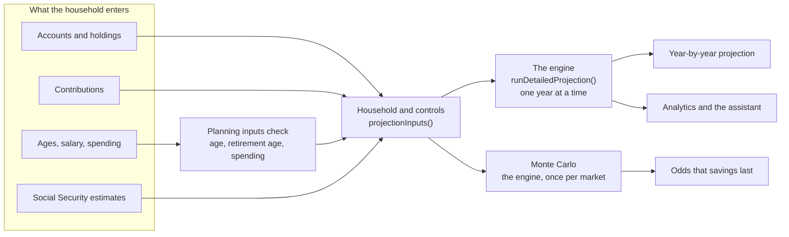

# How RetireWise works

Last reviewed: 2026-10-04

RetireWise answers one question above all: will the money last? It answers it with a single projection engine that walks a household's accounts forward one year at a time, then runs that same engine against {{mc.simulations}} simulated markets to give the odds. Every other figure in the app, from net worth to a holding's gain, comes from a small, named calculation, and each one is explained below.

This page runs the production engine. The calculators are the code that is live in the app, bundled from the same commit, so changing an input here recalculates exactly as the Projections page would. Every number quoted in the text is read from that code when the page is built.

<!--
How to edit
- Explain each calculation under a "### Title" entry: a sentence on the question it answers, the formula in a ```formula fence, then the fields:
  "- Code:" a file in backticks followed by the functions in it, in backticks; another file, its functions; and so on.
  "- Checked by:" the scripts or specs CI runs that prove it.
  "- Shown in:" where a household sees the result.
- Never type a figure the code holds. Write {{key}}; `pnpm how:check` lists the keys and fails on one it does not know.
- Place a calculator with a ```widget fence holding its name: playground, year, ss-claiming, tax, rmd, glide-path, monte-carlo, assumptions.
- Every function exported from a calculation module needs a row in the code map.
- Add a change-log line ("- YYYY-MM-DD · what changed · who") with every change.
-->

## The big picture

What a household enters becomes a set of inputs; one engine turns the inputs into a year-by-year projection; the same engine, run against many markets, gives the odds. Analytics, the assistant and the Projections page all take their figures from that one engine, so they cannot disagree.



Nothing is projected on a guess. Until the household has given its age, its retirement age and what it expects to spend, every projection asks for the missing figure instead of assuming one.

## Try it

An example household, with nothing real in it. Change any figure and the engine runs again, here in the page, in the same way the Projections page runs it: the steady line uses the scenario's average return every year, and the bands come from {{mc.simulations}} simulated markets.

```widget
playground
```

The steady market is what the Projections page draws as its main line. The odds are the share of simulated markets in which savings are still above zero at the end of the horizon. The bars below the chart show, for each year of retirement, what is spent and where it comes from: Social Security first, then savings, with the federal tax on those withdrawals paid out of savings too.

## The projection, year by year

The engine keeps each account separately and steps forward one year at a time, from the household's current age to the end of retirement: the years until retirement plus the years in retirement ({{default.retirementYears}} unless the household chooses otherwise). Everything is in nominal dollars, the dollars of the year in question, so a figure 20 years out includes 20 years of inflation. Each year is labelled with the age reached at its end.

### Inputs: from what the household entered to what the engine takes

- Code: `src/lib/projections/household.ts` `projectionSetupFromRows`, `src/lib/projections/build-accounts.ts` `buildProjectionAccounts`, `src/lib/projections/settings.ts` `controlsFromSaved` `projectionInputs`, `src/lib/planning-inputs.ts` `missingPlanningInputs` `givenMonthlySpending`
- Checked by: `scripts/test-missing-inputs.ts`, `scripts/test-one-engine.ts`
- Shown in: the Projections page; the assistant's retirement projection

The household's accounts, holdings and contribution records become one engine account each: its balance is the sum of its holdings, its contributions come from the records linked to it, and its salary and retirement year are its owner's. The Projections page's controls (claiming ages, spending, scenario, method, horizon, glide path) are added with their defaults where none were saved: the {{default.scenario}} scenario, {{default.retirementYears}} years of retirement, and a {{default.withdrawalRate}} withdrawal rate when a rate is used. If the age, the retirement age or the spending is missing, the engine is not run at all.

### 1. Growth

- Code: `src/lib/utils/projection-scenarios.ts` `runDetailedProjection`
- Checked by: `scripts/test-one-engine.ts`, `scripts/test-analytics.ts`

```formula
balance at year end = balance at year start × (1 + r) + contributions − withdrawals
r = the scenario's return, or the glide path's return at this age
```

Every account earns the same return in a given year, on its balance at the start of the year. Contributions are added at the end of the year, and withdrawals are taken at the end of the year after its growth. In the Monte Carlo, r is drawn at random for each year instead.

### 2. Contributions

- Code: `src/lib/utils/projection-scenarios.ts` `runDetailedProjection`, `src/lib/utils/salary-growth.ts` `getSalaryAtYear`, `src/lib/utils/contributions.ts` `totalAnnual` `fundedFractionOfYear`, `src/lib/constants.ts` `getIrsLimitForAge`
- Checked by: `scripts/test-analytics.ts`, `scripts/test-one-engine.ts`
- Shown in: the Projections page; Settings, Contributions

Contributions stop in the year their owner retires. For a contribution set as a percentage of salary:

```formula
salary(y)     = salary today × (1 + raise)^y
deferral %(y) = deferral % + escalation × y
employee      = deferral %(y) × salary(y)
match         = min(deferral %(y), matched-up-to %) × salary(y) × match rate
non-elective  = non-elective % × salary(y)            (or a flat amount)
paused share  = the part of the year a pause covers
employee'     = min(employee × (1 − paused share), IRS limit at the owner's age)
contribution  = employee' + match × (1 − paused share) + non-elective
```

A fixed-amount contribution uses the yearly amount (the per-paycheck amount times the paychecks in a year) plus any yearly increase, in place of the percentage. The IRS limit applies to the employee's own deferral only, never to employer money: {{irs.401k.under50}} for a 401(k) under 50, {{irs.401k.over50}} from 50 and {{irs.401k.60to63}} from 60 to 63 when catch-up is on. A pause stops the employee's money and the match earned on it; non-elective employer money is paid regardless.

### 3. Retirement spending

- Code: `src/lib/utils/projection-scenarios.ts` `runDetailedProjection`

```formula
price level P(y) = (1 + inflation)^(years from today)
spending(y)      = monthly spending today × 12 × P(y)
```

Spending is entered in today's dollars and inflated from today, not from the first year of retirement, so a household 15 years from retiring needs 15 years of inflation more than it spends today before retirement even starts.

### 4. Social Security in the projection

- Code: `src/lib/projections/settings.ts` `projectionInputs`, `src/lib/utils/projection-scenarios.ts` `adjustSSBenefit`, `src/lib/utils/financial-analytics.ts` `ssBenefitAtClaimingAge`

```formula
each benefit       = monthly benefit at full retirement age × share for the claiming age
Social Security(y) = (yours + partner's) × 12 × P(y)      from the first claim, in retirement
```

Benefits are entered in today's dollars, from each person's SSA statement, and rise with the scenario's inflation, which stands in for the cost-of-living adjustment. They are used only in retirement years, to reduce what savings must provide.

### 5. Withdrawals and their tax

- Code: `src/lib/utils/projection-scenarios.ts` `runDetailedProjection` `projectedIncomeTax` `taxableSocialSecurity`
- Checked by: `scripts/test-projection-tax.ts`

```formula
need(y)    = max(0, spending(y) − Social Security(y))
gross G(y) = the withdrawal that leaves need(y) after its own federal tax     (found by iteration)
withdrawal = max(G(y), required minimum distribution)
```

Savings provide what Social Security does not, and the federal tax on the withdrawal comes out of savings too, so the engine grosses the need up: it guesses a withdrawal, works out its tax, adds the tax to the need, and repeats until the answer stops moving by more than 50 cents. The required distribution is taken first from tax-deferred accounts; the rest of the withdrawal comes from every account in proportion to its balance. Only the tax-deferred part is taxed, together with the share of Social Security that income makes taxable.

There are two other ways to set the withdrawal. "A fixed rate of savings" takes a percentage of each year's balance, so it falls when markets do. "Whichever is higher" takes the larger of the two. A cap on withdrawals can be set, but it never pushes a withdrawal below the required distribution.

### 6. Required distributions that are not needed

- Code: `src/lib/utils/projection-scenarios.ts` `runDetailedProjection`, `src/lib/utils/financial-analytics.ts` `calculateRMD`
- Checked by: `scripts/test-projection-tax.ts`, `scripts/test-rmd.ts`

From {{rmd.start}}, the tax-deferred balance must pay out at least its required distribution, whatever the household spends. When the distribution is more than the need, the extra is taxed and then reinvested in the household's largest taxable account (or a new one, if it has none). It leaves the tax-deferred account; it does not leave the family.

### 7. What each year records

- Code: `src/lib/utils/projection-scenarios.ts` `runDetailedProjection`

Each year records the age, the phase, every account's balance, the total, the contributions, the withdrawal, its federal tax, the required distribution, anything reinvested, and the tax-deferred balance. Social Security is recorded in today's dollars, unlike every other column; the calculators on this page restate it in the year's own dollars, as the engine uses it.

Take any year of the example household apart. Every line is the engine's own result for that year; market growth is the difference that makes the year balance.

```widget
year
```

## Social Security

### Claiming age

- Code: `src/lib/utils/financial-analytics.ts` `ssBenefitAtClaimingAge`, `src/lib/utils/projection-scenarios.ts` `adjustSSBenefit`
- Checked by: `scripts/test-one-engine.ts`, `scripts/test-analytics.ts`
- Shown in: the Projections page's claiming-age controls; Analytics

```formula
claiming early, m months before full retirement age:
  share = 1 − {{ss.early1}} × min(m, 36) − {{ss.early2}} × max(0, m − 36)
claiming late, after full retirement age, up to 70:
  share = 1 + {{ss.delayed}} × years delayed
```

This is the Social Security Administration's rule. With a full retirement age of 67, claiming at 62 pays {{ss.at62}} of the full benefit and waiting to 70 pays {{ss.at70}}.

```widget
ss-claiming
```

### How much of it is taxed

- Code: `src/lib/utils/projection-scenarios.ts` `taxableSocialSecurity`
- Checked by: `scripts/test-projection-tax.ts`

```formula
provisional income = other taxable income + ½ × benefits
taxed share        = nothing below {{ss.taxFrom}} of provisional income
                     {{ss.taxMid}} of the excess above it, up to half the benefits
                     more steeply above {{ss.tax85From}}, up to {{ss.taxMax}} of the benefits
```

This is the IRS worksheet for a married couple filing jointly. Its thresholds are fixed in law and have never been indexed, so the engine keeps them in nominal dollars every year while the tax brackets rise with inflation.

## Taxes

### Federal income tax

- Code: `src/lib/utils/financial-analytics.ts` `estimateTaxMFJ` `getMarginalRate` `getRemainingInBracket`, `src/lib/utils/projection-scenarios.ts` `projectedIncomeTax`
- Checked by: `scripts/test-projection-tax.ts`, `scripts/test-analytics.ts`
- Shown in: the Projections page's year table; Analytics

```formula
income         = tax-deferred withdrawals + taxable Social Security
tax this year  = brackets( income ÷ P − standard deduction ) × P
```

The tax is figured in today's dollars and inflated back: the year's income is deflated by the price level, the standard deduction ({{tax.deduction}}) is taken off, the brackets ({{tax.brackets}}) are applied, and the result is inflated. This is the same as raising every bracket and the deduction with inflation each year, as the IRS does. Only married filing jointly is modelled. Withdrawals from taxable and Roth accounts are not taxed, so there is no capital-gains tax, and nothing is taxed while the household is still saving.

```widget
tax
```

### The tax table and its year

- Code: `src/lib/tax/table.ts` `buildTaxTable` `taxTableFreshness`, `src/lib/tax/load.ts` `loadTaxTable` `selectTaxTable`
- Checked by: `scripts/test-tax-reference.ts`
- Shown in: Analytics, with the year it uses

The brackets, deduction and Medicare figures live in a table that names its year, loaded from the database and checked strictly: a year with any piece missing is rejected, and the newest complete year that is not in the future is used. When no year passes, the figures built into the code ({{tax.year}}) are used and the page says so. The Projections page and the assistant's projection always use the built-in figures today (#61).

## Required minimum distributions

- Code: `src/lib/utils/financial-analytics.ts` `calculateRMD` `projectRMDs`
- Checked by: `scripts/test-rmd.ts`
- Shown in: the Projections page's year table; Analytics

```formula
required distribution = tax-deferred balance ÷ divisor for the age      from {{rmd.start}}
```

The divisors come from the IRS Uniform Lifetime Table: {{rmd.divisor.73}} at 73, {{rmd.divisor.80}} at 80, {{rmd.divisor.90}} at 90. The engine works out one distribution on the household's combined tax-deferred balance at the primary person's age.

```widget
rmd
```

## Markets and the odds

### Market scenarios

- Code: `src/lib/utils/projection-scenarios.ts` `runDetailedProjection`
- Shown in: the Projections page's scenario buttons

Each scenario is a return, a volatility and an inflation rate: {{scenario.count}} of them, from {{scenario.moderate.name}} ({{scenario.moderate.return}} a year, {{scenario.moderate.inflation}} inflation), the default, to {{scenario.lost_decade.name}} ({{scenario.lost_decade.return}}) and {{scenario.stagflation.name}} ({{scenario.stagflation.return}} with {{scenario.stagflation.inflation}} inflation). The returns are nominal. The steady projection earns the scenario's return every year; the volatility is used only by the Monte Carlo.

### Glide path

- Code: `src/lib/utils/glide-path.ts` `getGlidePathParams` `generateGlidePathSchedule` `getDefaultGlidePathConfig`
- Shown in: the Projections page, when the glide path is on

```formula
t        = (age − shift start) ÷ (shift end − shift start)        0 before, 1 after
t        = t²                                                    for "slow, then faster"
return   = start profile's return + (end profile's return − start profile's return) × t
```

Like a target-date fund, a glide path moves from a riskier mix to a safer one as retirement approaches. Each profile is a mix of stocks and bonds with an expected return and volatility; between the two ages the engine blends them, and the Monte Carlo blends the volatility too.

```widget
glide-path
```

### The odds that savings last

- Code: `src/lib/projections/monte-carlo.ts` `runProjectionMonteCarlo` `seededRandom`
- Checked by: `scripts/test-one-engine.ts`
- Shown in: the Projections page; the assistant

```formula
for each of {{mc.simulations}} markets:
  each year's return = expected return + volatility × z,   z drawn from a standard normal distribution
  run the engine with those returns
success  = the share of markets in which savings are above zero at the end
bands    = the 10th, 25th, 50th, 75th and 90th percentile balance of each year
```

Each simulated market is the engine itself, given a different return for every year: taxes, required distributions, claiming ages and contribution limits are the engine's own, not a simplified second model of them. The random numbers come from a seeded generator (mulberry32, seed {{mc.seed}}), so the same household gets the same odds on every visit, in the browser and on the server, and a what-if scenario is compared against the same markets as the base case rather than different luck.

The example household under each market scenario:

```widget
monte-carlo
```

## Simplifications and limits

A model is useful because it leaves things out. These are the choices this one makes, and the places where it is known to be wrong, so a figure is never trusted further than it deserves.

### Choices the model makes

- One return a year for every account, on the balance at the start of the year. Contributions arrive, and withdrawals leave, at the end of it, which is slightly kinder to a portfolio in drawdown than withdrawing at the start.
- Returns in the Monte Carlo are drawn independently each year from a normal distribution. Real markets have runs of good and bad years and fatter tails, and inflation here never varies.
- Withdrawals come from every account in proportion to its balance, after the required distribution. The assistant compares four fixed orders (taxable first, Roth last and so on) as a separate calculation; the engine does not choose an order.
- Federal income tax only, married filing jointly. No state tax, no capital-gains or dividend tax on taxable accounts, and nothing taxed while the household is still saving.
- Pensions and annuities are treated as balances that grow and are drawn down, not as income streams.
- Social Security received before retirement is not saved, and Social Security above what the household spends is not saved either.
- Withdrawals begin when the primary person retires. A partner who keeps working keeps contributing, but their salary does not pay for spending.
- The "fixed rate of savings" method takes a percentage of each year's balance, so spending falls when markets do; it is not the classic 4% rule, which fixes the first year's amount and raises it with inflation.
- IRS contribution limits, the withdrawal cap and fixed contribution amounts stay in today's dollars for ever; only spending, Social Security and the tax brackets rise with inflation.
- When savings run out the shortfall is not carried forward: the projection simply reaches zero.
- Vesting is reported on the Contributions page but never reduces a projected balance.

### Where it is known to be wrong

- A couple's Social Security starts in the year the first partner claims, so a later claim is paid early (#65).
- The Projections page shows Social Security in today's dollars next to future dollars, and its spending-versus-income card is not the engine (#66). This page shows it as the engine uses it.
- The Social Security form's cost-of-living, planned-claiming-age and spousal fields are never used (#67).
- Fixed-amount contributions with employer money are counted twice, a fixed contribution paused today never resumes, and an inactive contribution record can zero an account (#68).
- Three what-if scenarios on the Projections page miss what they change (#69).
- Required distributions follow the IRS table to 95 and a steeper formula after it, and are taken on both partners' combined balance from 73 for everyone (#70).
- The projection uses the tax figures built into the code, not the yearly table (#61); the contribution limits are fixed for 2025 (#31); and the 2025 tax figures predate the July 2025 law (#56).

## Change log

- 2026-10-04 · First version · Claude
